> 统计口径：git 提交作者 `李超 <C_Li02@163.com>` / `李超 <lichao@whaty.com>`
> 扫描范围：`D:\idea_project`（既有 14 个仓库）+ `D:\qhfx`（3 个仓库）；本次另对 `learnspace-ai-study-api`、`learnspace-ai-study-service`、`learnspace-ai-study-web` 做源码快照扫描
> 时间跨度：2026-04-09 ~ 2026-08-14（约 18 周）
> 提交总数：**141 次**，分布在 **10 个仓库**、**3 条既有业务线**；LearnSpace AI Study 按源码快照纳入，未冒充既有 git 作者统计
> 最后更新：2026-08-14（新增 LearnSpace AI 原生学习平台架构、补充 learnspace Redis/MQ 全仓架构核验）

---

## 一、总览

### 1.1 提交分布

| 业务线 | 仓库 | 提交数 | 时间区间 | 角色 |
|---|---|---|---|---|
| **AI 智慧教学平台**<br>(清华附小) | qhfx-api | 22 | 04-09 ~ 05-28 | 后端最活跃贡献者 |
| | qhfx-web | 27 | 04-09 ~ 05-28 | 前端业务主力 |
| **站点成本核算平台** | site_cost | 45 | 05-28 ~ 08-04 | **创建者 / 架构设计者** |
| **learnspace 课程空间** | learnspace-rest-api | 15 | 06-23 ~ 08-10 | 专项需求负责人 |
| | discuss-web | 11 | 06-30 ~ 07-09 | 同上 |
| | learnspace-doc2 | 4 | 06-26 ~ 08-10 | SDK 文档维护 |
| | learnspace-admin-api | **6** | 07-01 ~ **08-13** | 同上 + **权限子系统设计者** |
| | learnspace-admin-web | **7** | 07-01 ~ **08-13** | 同上 |
| | learnspace-learning-web | 2 | 07-10 ~ 07-21 | 同上 |
| | learnspace-xxl-job-executor | 1 | 07-30 | 同上 |
| **LearnSpace AI 原生学习平台** | learnspace-ai-study-api / service | 源码快照 | 当前版本 | **核心设计者 / 架构负责人 / 全栈开发者** |
| | learnspace-ai-study-web | 源码快照 | 当前版本 | 同上 |

### 1.2 三条既有业务线的时间接力

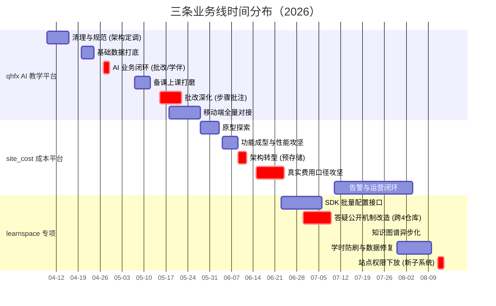

三段工作**首尾相接、中段并行**：qhfx 交付完成的同一天（05-28）site_cost 起第一个功能提交；06-23 起 site_cost 与 learnspace 双线并行推进两个月。08-04 site_cost 收尾后，learnspace 侧独立推进，最新一段是 08-12 ~ 08-13 的站点权限子系统（建成 → 修跨库事务缺陷 → 权限模型重构 → 页面细节收尾，三天内四个阶段）。

### 1.3 三条既有业务线之间的关系

三个项目不是孤立的，通过「教育业务 → 数据资产 → 成本归因」形成一条闭环：

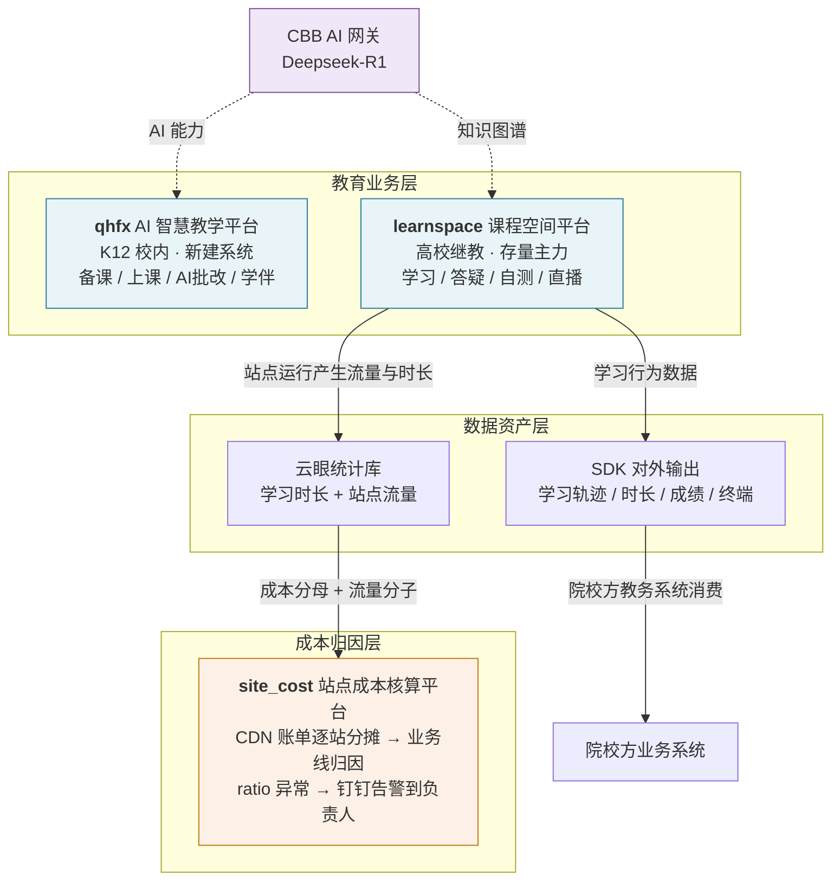

- **learnspace 是数据源头**：李超在 learnspace 侧开发的学习轨迹 / 学习时长 / 终端类型 SDK 接口，输出的正是"哪个站点、哪个学生、学了多久"这类行为数据；而 site_cost 消费的云眼 `site_studytime_daily`（学习时长）就是同一批站点的运行数据。**同一份学习时长，在 learnspace 侧是教学结果，在 site_cost 侧是成本分母。**
- **site_cost 是运营侧闭环**：learnspace 多站点（`siteCode` 隔离）架构带来的直接后果是几百个站点共用十几家 CDN，账单无法归因。site_cost 正是为这个问题而建。
- **qhfx 是能力前沿**：把 AI（备课/批改/学伴）在一个新建的小体量系统里跑通，与 learnspace 这类存量大平台形成"新能力试验田 vs 稳态主力"的分工。
- **LearnSpace AI Study 是 learnspace 的 AI 原生学生端新域**：本次扫描的项目直接复用课程、目录、选课、资源和 SSO 主数据，在存量课程空间之上新增测评、知识点掌握度、多 Agent 对话、GenUI 和游戏化闭环；详见第六节。

### 1.4 技术能力画像

从三条既有业务线与新增 AI Study 项目横向看，能力覆盖面：

| 维度 | 体现 |
|---|---|
| **后端** | Spring Boot 3.4/3.5 + JDK 17（site_cost / qhfx）、Spring Boot + JDK 8（learnspace）、MyBatis-Plus、多数据源动态切换、事务边界设计、Neo4j 图数据库 |
| **前端** | Vue 3 + TS + Vite + Element Plus（qhfx PC）、Vant 4（qhfx 移动端）、Vue 2 + Element UI（learnspace）、原生 JS + layui（site_cost） |
| **数据/SQL** | 分区表设计、幂等 upsert、`FORCE INDEX` 索引干预、BigDecimal 精度控制、跨 9 个异构库的并发查询 |
| **架构** | 实时查询 → 离线预聚合的架构转型、同步 → 异步改造、灰度开关与回退设计、防重入锁、降级不阻塞 |
| **缓存** | Redis 任务状态机（三态 + TTL 兜底）、多套缓存的一致性清理、进程内 `ConcurrentHashMap` 结果缓存（双 key 设计 + 主动失效）、JVM 缓存对象的深拷贝隔离、AI token 内存缓存 + 双重检查锁 |
| **AI 工程** | Prompt 工程（细粒度步骤拆分 + 原文精确引用）、截断 JSON 修复、AI 输出结构化落库、token 缓存 |
| **运维/工程化** | XXL-JOB、Spring `@Scheduled`、Jenkins 部署脚本、钉钉告警、OAuth2 SSO 接入、单测与集成测试 |

一个贯穿既有项目与新增 AI Study 的稳定习惯：**重大改动先写方案文档再落地**。site_cost 有 `6b2c4ee` 纯文档提交；qhfx 有 16 份 `doc/开发/*.md` 方案（大部分出自其手）；learnspace 有 SDK 文档与代码严格一一对应；AI Study 有 `Agent自动委派切换方案.md`、数据表清单与 V100~V109 迁移脚本。

### 1.5 缓存与消息：三个既有项目与 AI Study 的四种选择

既有三个项目加上新增 AI Study，对 Redis / MQ 的取法差异很大，但**差异本身是有理由的**，不是习惯不同。核实后的实际情况：

| 项目 | Redis | MQ | 缓存实现 | 他在这条线上做了什么 |
|---|---|---|---|---|
| **learnspace** | 有（WhatyCache/Redisson；`projectName`、逻辑 cache name、siteCode/key 维度隔离，环境再切 `redis.db`） | RocketMQ（4.x/5.x 双客户端、66 个源码枚举 topic 字面量去重后） | 公司 WhatyCache 框架（`CacheUtil` / `LearnspaceCacheUtil`） | **Redis 任务状态机**（知识图谱异步化）、**多套缓存一致性清理**（SDK 批量接口 + 课程发布）。未碰 MQ 生产/消费代码 |
| **site_cost** | **刻意不用** | **刻意不用** | 进程内 `ConcurrentHashMap` + 10 分钟 TTL | **缓存与失效机制的作者**：双 key 设计、7 处主动 `clearCache`、流水线 `tryLock` 防重入 |
| **qhfx** | 有（Redisson 单机 db0，框架层用） | **无** | 框架 Spring Cache + Sa-Token 的 Caffeine L1 | **`CbbAiClient` 的 token 内存缓存 + 双重检查锁**（他新建） |
| **LearnSpace AI Study** | 有（复用 WhatyCache/Redisson，缓存异常降级） | 有 Topic/Consumer 抽象，默认日志降级；任务可同步 fallback | `CacheService` + 集中 Key/TTL；资源访问 Redis/进程内时间窗去重 | **AI 对话上下文、协议解析、掌握度、GenUI、MQ 降级与 SSE 并发底座的设计者** |

**三个「不用」的判断**都站得住：

- **site_cost 不用 Redis**：单实例部署，数据由每日定时流水线全量重算，缓存只是查询加速。引入 Redis 只增加运维面，换不到能力 —— 与它「无 Lombok、无 Flyway、无前端框架」的整体轻量取向一致。
- **site_cost 不用 MQ**：全链路是「定时触发 → 串行四步 → 写本地表」，没有跨服务解耦需求，`@Scheduled` 足够。
- **qhfx 不用 MQ**：AI 调用是同步请求-响应模型，异步只需 `@Async` + 线程池。
- **LearnSpace AI Study 的 MQ 仍是可插拔骨架**：`MqProducer`、Topic 和 Consumer 已抽象，默认 `LoggingMqProducer` 保证无 MQ 环境可启动；引导任务和资源热度都有同步/直写降级，不能把当前代码描述成已接通生产 RocketMQ。

**一处需要说清的边界**：`learnspace` 的 RocketMQ 体系（topic 枚举、双客户端切换、`SiteMqMsg` 的 siteCode 路由、消费幂等、延迟重试阶梯）**规模很大但不是他的工作** —— 他 15 笔 rest-api 提交中没有一笔改动 MQ 生产者或消费者代码。admin-api 的「MQ Topic 管理」菜单也被他在权限下放设计文档里**明确列入「本期不包含」**。这条边界值得记录，因为它反映的是同一种取向：**只动需求范围内的东西**。

---

## 二、业务线一：site_cost 站点成本核算平台

> **45 次提交 / 2026-05-28 ~ 08-04 / 项目创建者、主要开发者、架构设计者**

### 2.1 项目定位

华腾内部的 **CDN 成本核算与归因平台**。

**要解决的问题**：公司在阿里云、腾讯云、网宿等十余家 CDN 上为几百个教育站点付费，账单只到「CDN 厂商」这一粒度，无法回答三个问题——哪个站点烧了多少钱、这笔钱该由哪条业务线承担、哪个站点流量异常。

**产出三件事**：
1. 按课程空间编号 + 时间区间查询站点的学习时长、流量、**预估费用**、**真实费用**，支持 Excel 导出
2. 部门（业务线）与负责人维护后台
3. 每日 + 月度钉钉告警，@ 到对应部门负责人

### 2.2 技术栈

Spring Boot 3.4.0 / JDK 17 / MyBatis-Plus 3.5.7 / dynamic-datasource 4.3.0 / Hutool / POI / MySQL 8（月度 RANGE 分区）/ 前端原生 HTML+JS+layui（无构建工具）/ OAuth2 对接 WTOA 统一用户中心 / Spring `@Scheduled` / 钉钉自定义机器人（HmacSHA256 加签）。

刻意保持轻量：无 Lombok、无 Flyway、无 Redis（进程内 `ConcurrentHashMap` 缓存）、无前端框架。

**一个关键架构决策**：9 个异构远程数据源通过 `DynamicDatasource.callWith(ds, action)` 做**线程本地切换**，而不是 `@DS` 注解——因为查询链路是并发的，注解式切换在线程池里会失效。

### 2.3 核心数据流

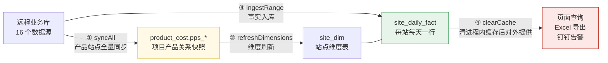

每天 05:00 一条串行流水线跑完全程（`SiteStaPipelineService.java:40-70`），`ReentrantLock.tryLock()` 防重入，任一步异常则中止，绝不留半成品。

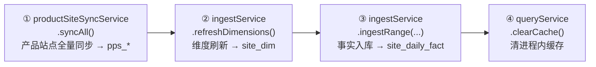

### 2.4 关键业务设计（技术难点）

#### 站点的三重身份与云眼 code 匹配

一个「站点」在系统里有三个 code，映射关系是全系统最脆弱的地方：

- `site_code` 课程空间编号（业务主键）
- `yunyan_code` 云眼站点 code（学习时长/流量的归集键）
- `domain_ids` 域名 id 列表（CDN 流量的真实归集键，一站可多域名）

`YunyanCodeResolver`（`utils/YunyanCodeResolver.java:15-34`）用**五策略 + 存在性校验**解决匹配：

1. 直接读 `pe_web_site.yunyan_code`
2. 硬编码特殊映射（仅 4 个站点）
3. 域名反查
4. 约定前缀 `sta_<编号>`
5. 同名兜底

关键设计是**候选列表 + 云眼侧存在性校验**而非「取第一个」。代码注释记录了根因：约 9 成未命中站点根本不在 `control.pe_web_site` 里，靠策略 4 挽回 **252 个**；另有站点的 `yunyan_code` 带 BOM/零宽字符（`sta_gpsgv3`）或用错连字符（`sta-zyys` 实为 `sta_zyys`），所以必须让高优先级的坏候选自动落空。`normalizeCode` 专门清 `​/200C/200D/FEFF`。

#### 预估费用 vs 真实费用

两套口径并列展示，**差异本身就是排查信号**。

预估费用是线性折算：
```
总流量(GB)   = (自有流量MB + bxqk分配流量MB) / 1024
预估费用(元)  = 总流量(GB) × 单价      // 可配置, 默认 0.033
```
全程 `BigDecimal`，单价由字符串构造避开 double 二进制误差；汇总卡片基于原始值累加后只格式化一次，保证「合计预估费用 == 合计流量 × 单价」自洽。

真实费用用**「有效单价」总账守恒反向分摊**（`SiteStaIngestService.java:442-593`）：
```
有效单价  = 当天该CDN账单总额 / 当天被追踪站点该CDN流量(GB)
自有费用  = Σ各CDN(该站点当天该CDN流量GB × 该CDN当天有效单价)
真实费用  = 自有费用 + bxqk聚合站点自有费用的分摊
```
这样每个 CDN 池天然满足 `Σ被追踪站点真实费用 == 账单总额`。分池规则：阿里云 id 1/2/4 合并共用同一有效单价，腾讯云 id 11 单独，其余固定单价 CDN 各自独立折算。

**两个被显式承认而非掩盖的缺口**（工程判断力所在）：
- **孤儿账单**：某 CDN 当天有账单但被追踪流量为 0，钱无处分摊 → 当天该账单丢弃并留痕打日志
- **数据源降级**：`yunweichenben` 库（千万行级）不可用时降级记 0，而不是让整个入库失败

#### bxqk 聚合站点的费用分摊口径

「百校千课」是聚合站点，多校共用一个域名，流量混在一起。按学习时长占比分摊：
```
某站点当天分配流量 = 当天bxqk总流量 × (该站点当天bxqk秒 / 当天全站点bxqk秒之和)
```

三个刻意的口径选择：
- **按天算死**再区间求和，而不是「区间合计后一次分配」——后者在流量与时长的日分布不同步时会失真
- 分母为 0 时**不分配、不兜底摊给其他站点**
- bxqk 聚合站点**自身行不吃分摊**（钱正从它身上摊出去），查询时整行排除

"按天算死"的额外收益：把所有指标变成**可加量**，于是查询退化成一条 `GROUP BY SUM` 的本地 SQL，查询期零后处理。

#### 进程内结果缓存：为什么这里不需要 Redis

`SiteStaQueryService.java:104-114` 的缓存是一个 `ConcurrentHashMap<String, CachedResult>`，TTL 硬编码 10 分钟。设计上有两处值得记录：

**双 key 结构让窄查询免于远程访问**（注释原文）：

```
key 有两种, 互不冲突:
  全量    : startDate~endDate
  窄查询  : startDate~endDate~关键字(小写)
全量缓存命中时, 带关键字的查询也可直接内存过滤, 无需任何远程查询。
```

关键在最后一句 —— 全量结果在缓存里时，**带关键字的查询走内存过滤而不是回源**。这让「先看全量、再搜某个站点」这个最常见的操作序列只产生一次跨库查询。缓存条目存的是已排序的数据行 + 未匹配站点行 + 按站点编号索引的原始指标（`CachedResult`，`:161-168`），原始指标单独留一份是为了汇总卡片能基于未格式化的值累加。

**失效靠主动清除而非等 TTL**：`clearCache()` 在 7 处被调用 —— 每日入库任务成功后、流水线跑完后、三个手动回填接口成功后、设置站点手工部门后。也就是说 **10 分钟 TTL 只是兜底，正常路径下数据一变就立即失效**。这个设计让「查询看到的永远是最新入库结果」，同时避免了缓存与预存储表之间出现窗口期不一致。

**为什么单实例进程内缓存够用**：数据由每日定时流水线全量重算，缓存只承担查询加速；不存在多实例间需要共享的会话或状态。引入 Redis 只增加一个运维组件和一次网络往返，换不到任何能力。

#### 防重入：tryLock 而非 lock

流水线锁（`SiteStaPipelineService`）与产品站点同步锁（`ProductSiteSyncService`）都用 `ReentrantLock.tryLock()`，防的是「手动触发」与「定时任务」撞车。

同项目里 `IngestLock`（lizhuang 8 月新增，用于线程池化后的入库互斥）把这个取舍的理由写得最清楚，可作为同一模式的注解：

> **为什么用 tryLock 而不是 lock** —— 拿不到锁说明另一个入库任务正在跑，排队等待没有意义——入库是幂等的全量重算，等它跑完再跑一遍纯属重复劳动，还会占住调度线程。超时后跳过并记日志，下一个 cron 周期自然会补上。
>
> **单实例前提** —— 这是 JVM 内的锁，只在单实例部署下有效。若将来扩到多实例，需换成数据库行锁或 shedlock 之类的分布式锁，否则同一任务会在每个实例各跑一次。

**「幂等 → 所以可以跳过」这个推理链是整个系统的一致取向**：入库幂等（主键 upsert）让跳过一次无代价，跳过无代价才敢用 `tryLock` 而不是排队，不排队才不会占住调度线程。同一条逻辑也解释了为什么默认每次重算最近 5 天 —— 重复计算是安全的，所以宁可多算来容忍上游数据迟到。

#### 部门/业务线/负责人匹配

业务线由 `product_cost` 的**项目产品关系推导**：`courseSpaceCode → projectId → productCode → 部门标签`。合法部门 8 个（考试系统 / 课程空间 / 直播 / 资源库 / 同等学历 / 学历教育 / 优训平台 / 自考平台），一个课程空间关联多个项目时按优先级定序并打警告。

设计巧妙处：
- **有效部门 = `COALESCE(NULLIF(dept_name,''), manual_dept)`** —— 产品关系优先，为空才回退管理页手工补录
- `manual_dept` **不在维度刷新的 upsert 列清单内**，所以每日刷新不会覆盖手工值

#### pps_* 产品站点快照

`812b562` 把原本独立的 `project-product-sites` 项目（XXL-JOB 调度）整体吞并进来。同步 10 个产品库，在内存重建项目-产品关联，再**一个事务整体替换** `pps_project` / `pps_project_product`。

两道防空护栏，都在防「远程库抖动导致快照被清空」这类不可逆事故：
- 课程空间源返回空 → 直接抛异常拒绝覆盖
- 写入层再校验一次空项目快照

`a62510d` 修的是一个隐蔽 bug：内存里用原始 `siteCode` 做 key，而 MySQL `pps_project.site_code` 是**大小写不敏感排序规则**，导致同一站点在内存中被当成两个项目、部门匹配错乱。修法是统一 `siteCodeKey() = trim().toLowerCase()`。

#### 钉钉告警设计

判定指标是**比值 `ratio = 总流量(GB) / 总时长(h)`**，即「每学习一小时烧掉多少 GB」——一个与站点规模无关的**归一化异常指标**。三档阈值前后端严格对齐：

| ratio | 状态 |
|---|---|
| < 0.3 | 正常 |
| 0.3 ~ 0.7 | 偏高 |
| > 0.7 | 严重偏高 |

两个定时任务：
- **每日 09:30**：取 T-3 全量站点，筛 `ratio > 0.7` **且** 真实费用 > 5 元。费用门槛用于滤掉"时长极小导致比值虚高"的噪声站点。每个异常站点同时展示**当日 / 月初至今 / 年初至今**三周期指标及各自独立状态，用于区分单日波动与长期趋势。
- **每月 3 日 09:40**：借 T-3 恰好落在上月最后一天来确定上月区间，门槛提高到 150 元，固定发两条消息（汇总 + 查看通知）。

@ 人链路：站点有效部门 → `dept_manager.manager_phone` → `LinkedHashSet` 保序去重，无部门站点兜底 @「其他」部门负责人。**一个钉钉细节**：markdown 的 @ 高亮必须正文出现「@手机号」字面量，光靠 `at.atMobiles` 不显示，所以 `sendMarkdown` 自动追加到正文末尾。

#### 事实表写入的幂等设计

`site_daily_fact` 每站每天一行，只存 5 个**底量**（自有时长/bxqk秒/自有流量/分配流量/真实费用），名称部门不冗余进事实表。主键 `(stat_date, site_code)` 同时充当幂等 upsert 约束和 InnoDB 物理聚集键。

单天写入顺序有讲究：先删当天事实行（清理维度收缩后的残留站点）→ 批量 upsert → **末位**写 `site_daily_bxqk` 完成标记。标记永不早于明细，所以「缺天扫描续跑」不会把写了一半的天误判为完成。默认每次重算最近 5 天，容忍上游数据迟到。

### 2.5 贡献演进（分五阶段）

演进主线：

```
摸数据(原型) → 功能成型 → 性能撞墙 → 架构转型(预存储) → 口径攻坚(real_cost) → 运营闭环(告警) → 上游吞并(pps)
```

**阶段一：原型探索（05-28 ~ 06-03，3 提交）**
`221fc1a` 是仓库的**首个功能提交**（此前仅有他人建的空仓库 Initial commit）。从零搭 Spring Boot 骨架、9 数据源配置、通用 SQL 执行器。这个阶段在**摸数据**：搞清云眼库怎么查、课程空间怎么匹配。

**阶段二：功能成型与性能攻坚（06-04 ~ 06-09，6 提交）**
`7f77131` 建立 `SiteStaQueryService`（后来 974 行，系统中枢）。紧接着 `605588c` + `3333d3b` 两连击引入**查询并发化**与窄查询优化，同时删掉原型期的一次性格式化工具。前端换 layui、加等待进度条与数据导出。`c9867fc` 立下 T-2/T-3 数据可见性约束。

**阶段三：架构转型 —— 预存储（06-09 ~ 06-12，3 提交）**
`6b2c4ee`「更新数据库预存方案」是**纯文档提交**（+111/-62 行方案，零代码），先写方案再落地。

`482ed69` 落地「查询接入本地预存储 + 汇总卡片 + 定时入库」，把系统从**实时跨库查询**改成**离线预聚合 + 本地轻查询**，同时保留 `site-sta.query.source=local/remote` 开关做灰度与回退。这是整个项目**最大的一次架构变更**，也是后续一切（告警、月报、多周期累计）的前提。

**阶段四：真实费用与口径对账（06-15 ~ 06-24，9 提交）**
最硬的一段。`8df2c9f` 引入 real_cost 按天预存储。

`74f63f9` 是**单次提交技术含量最高的一个**，一次解决三件事：分摊口径改总账守恒有效单价法、抽出 `YunyanCodeResolver` 消除查询与入库的重复实现、汇总精度 double 改 BigDecimal。同时产出《真实成本计算流程》《真实费用偏低排查与修复方案》两份文档。

`f0c8b14` 与 `2c2131b` 是**对账攻坚**：写一次性诊断测试把账算平，账平了就删掉临时测试（`2c2131b` 删了 1300+ 行）。同期 `d7fa072` 接入 SSO。

**阶段五：告警与运营闭环（07-10 ~ 08-04，10 提交）**
系统从「查询工具」变成「主动运营工具」。`ddcacb5` 一次性交付部门管理页 + `dept_manager` 表 + 权限拦截器 + 钉钉通知器 + 告警定时任务（约 1400 行）；`4bbf94c` 统一前后端阈值并扩展为三周期告警；`812b562` 吞并 `project-product-sites` 流水线（约 1200 行）；末尾四笔迭代月初提醒。

这阶段显著变化是**测试策略成熟**：不再是一次性诊断脚本，而是留下 `SiteCostAlertServiceTest`、`ScheduledTasksSimulationTest`、`DailyPipelineIntegrationTest` 等可回归单测。为此还专门给告警和流水线方法加了「接受明确日期」的包可见重载 —— **为可测性改设计**。

### 2.6 角色与协作

**创建者 + 主要开发者 + 架构设计者**，证据多重一致：

- **代码所有权接近 100%**：git blame 显示核心文件每一行都归他 —— `SiteStaQueryService` 974/974、`SiteStaIngestService` 774/774、`SiteCostAlertService` 393/393、`index.js` 755/755、`application.yml` 172/172、`README.md` 278/278
- **架构决策都有配套方案文档**：三次重大转型（预存储、真实费用口径、吞并 pps）每次都是「先写 doc 再改代码」
- **发布负责人**：两个 `lichao@whaty.com` 提交都是 `Merge branch 'dev_lc' into 'master'` —— 工作邮箱执行 master 合并，个人邮箱日常开发
- **系统管理员**：`admin.allowed-users` 第一个就是 `lichao`

**与 lizhuang 的分工**：按业务域垂直切分，几乎零代码重叠。

| | 李超（43） | lizhuang（36） |
|---|---|---|
| 业务域 | **CDN 流量成本** | **直播成本** |
| 时间 | 05-28 ~ 08-04（奠基） | 07-16 ~ 08-10（扩展） |
| 分支 | `dev_lc` | `feature/.../live-cost-statistics-page` |
| 核心表 | `site_daily_fact`（**天**粒度） | `live_cost_monthly_fact`（**月**粒度） |
| 告警口径 | 比值阈值 0.3 / 0.7 | 月度环比（倍数 + 绝对增量取并集） |

关系是「**架构者 → 跟随者**」：李超在 5-7 月建立了「远程库 → 预聚合本地表 → 轻查询 → 钉钉告警」这套模式并写进文档；lizhuang 7 月中入场，把同一套范式套用到直播成本这个新业务域，并复用了 `DingTalkNotifier`、多数据源配置模式、预聚合 + 定时入库 + 前端 tab 的整套基础设施。

---

## 三、业务线二：qhfx 清华附小 AI 智慧教学平台

> **49 次提交（api 22 + web 27）/ 2026-04-09 ~ 05-28 / 全栈业务主力、AI 能力落地负责人**

### 3.1 项目定位

面向 K12 校内教学全链路的 AI 教学平台，覆盖五类角色：管理员（年级/班级/学期/教师/学生）、教师（备课/上课/批改/学伴/题库/课堂总结）、学生（作业/学伴/直播/报告）、校长看板、门户。

| 仓库 | 角色 | 李超参与 |
|---|---|---|
| `qhfx-api` | 后端单体（RuoYi-Vue-Plus 二次开发） | 22（后端最活跃） |
| `qhfx-web` | 前端（PC + 移动端 `/m/` 同仓） | 27 |
| `qhfx-office-add-ins` | PowerPoint 任务窗格插件 | 未参与 |

### 3.2 技术栈

**后端**：RuoYi-Vue-Plus 5.5.2 / Spring Boot 3.5.9 / JDK 17 / Sa-Token 1.44 / MyBatis-Plus 3.5.14 / Redisson / 多租户。

业务包结构由李超在 `a102e30` 定型：把独立 `ruoyi-ai` 模块整体删掉，代码内聚到 `ruoyi-system` 下的 `controller/{education,lessonprep,companion}`（181 文件改动的大重构）。

**前端**：plus-ui 改造 —— Vue 3.5 + TypeScript + Vite + Pinia + Element Plus 2.11 + UnoCSS；移动端 Vant 4；PPT 预览 `@vue-office/pdf`；Word 导出 `docx`；图表 echarts。

**AI 服务**：不是 OpenAI 直连，而是对接公司内部 **CBB AI 网关**（`api.webtrn.cn`，OAuth token + `/api/v2/misc/chatgpt/*`），默认模型 **Deepseek-R1**。

`CbbAiClient`（429 行，李超在 `741d597` 新建）提供 startNewChat / chat / streamChat / simpleChat / stopChat，含 token 缓存与双重检查锁。**四个消费方全部走同一个 client**：备课助手、智能体、课堂助手、学伴、批改 —— 他是这一层 AI 技术底座的持有者。

**token 缓存是进程内内存而非 Redis**（`CbbAiClient.java:43-73`），这个选择在 RuoYi 这种 Redis 无处不在的框架里反而需要留意：

```java
private volatile String accessToken;
private volatile long tokenExpiresAt;
private final ReentrantLock tokenLock = new ReentrantLock();
```

刷新走标准双重检查：无锁快速路径判 `accessToken != null && now < tokenExpiresAt - 60_000` → 拿 `ReentrantLock` → 锁内再判一次（防多线程同时穿过第一关重复刷新）→ 才真正调 `refreshToken()`。过期时间取响应的 `expires_in`（缺省 43199 秒）换算成绝对时间戳，并**提前 60 秒失效**，避开「校验时还有效、请求到达时已过期」的边界窗口。

选内存不选 Redis 在这个场景是对的：OAuth2 `client_credentials` 的 token 是**进程级凭证**而非用户会话，client 是单例 Bean，`volatile` + `ReentrantLock` 足以保证进程内正确性；多实例部署时各自持有一份 token，代价只是多几次刷新调用，OAuth2 平台允许多 token 并发有效。相比之下走 Redis 要多一次网络往返，且引入了「谁负责刷新」的协调问题。

**但这一层缺三样东西**（属于事实记录，非设计缺陷判定）：AI 调用全程同步阻塞（对话 120 秒超时、流式 300 秒），没有重试、限流或熔断。唯一的防重手段是 `EduHomeworkSubmitController` 上的 `@RepeatSubmit(interval = 30000)`（基于 Redis key 的 30 秒 TTL），能挡单用户连点，挡不住并发洪峰。批改这类耗时 AI 请求同步占用 HTTP 线程最长 120 秒，在并发量上来后会是首个瓶颈点。

### 3.3 核心业务模块

#### 智能批改（grading）—— 最深入的模块

完整链路：

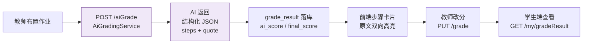

**Prompt 工程是这个模块的核心难点**（`AiGradingService.java:183-218`）。系统 prompt 明确要求：极其细粒度拆分，不要只拆审题/计算/作答三大步，**每一行、每一个公式、每一个推导都是独立步骤**。

每个步骤必须给 `quote` —— **学生原文的精确子串**，供前端做高亮定位。同时强制 JSON 字段顺序 `totalScore → items → comment → suggestions → steps`，并配 `tryRepairTruncatedJson` 与 `ensureCommentAndSuggestions` 兜底 AI 输出被截断的情况。调用参数 `temperature=0.3, maxTokens=8000`。

**数据模型三层**：

- `items`（ScoreItem）评分维度
- `annotations`（Annotation）段落批注
- `steps`（StepAnnotation）：stepIndex / stepName / **quote** / score / maxScore / status / feedback / analysis

**持久化设计**：`grade_result` 表用 `items_json` / `steps_json` / `suggestions_json` 三个 JSON 列，`ai_score` 与 `final_score` 分离（保留 AI 原始评分与教师修改后评分），唯一键 `uk_homework_student`；另有 `grade_annotation` 表区分 AI/教师来源。持久化调用放在主流程之后且异常不影响主流程。

**前端双向高亮联动**（`grading/index.vue`，1792 行）：`applyStepHighlights` 按 quote **长度降序**在答题 HTML 里插 `span.step-highlight` 标签 —— 长串优先是为了避免嵌套破坏；`highlightStep` 做卡片与原文的双向联动滚动。

#### 智能备课 / 备课助手（lessonPrep）

- **多 PPT 管理**：独立表 `ai_lesson_ppt`（pptId/docId/fileName/filePath/**pdfPath**）替代原来 `ai_lesson_doc.ppt_path` 单字段
- **PPT 转 PDF**：`PptToPdfConverter.java:23-57` 用 ProcessBuilder 调 LibreOffice soffice，60 秒超时，上传时同步转换，失败抛 ServiceException 提示装 LibreOffice
- **AI 助手**：`AiChatPanel.vue`（979 行）对话/新建会话/欢迎语；prompt 含 `[推荐问题]` 标记解析与调用失败降级
- 主编辑器 `DocEditor.vue` 1763 行

#### 智能上课 / 课堂助手（classroom）

两阶段状态机 `phase = selectCourse | classroom`：先拉教师课程，选课后按课程名拉 PPT 列表，弹窗选 PPT，无 pdfPath 的直接标警告不可预览。

**PPT 翻页定位是他两次修复的技术难点**。`@vue-office/pdf` 是虚拟滚动、canvas 绝对定位，`scrollIntoView` 无效。第二次修复（`1fc28c0`）改了结构：外包一层 `pdfHostRef`，通过 `host.querySelector('.vue-office-pdf')` 拿真实滚动容器，改为读 canvas 的 top 再 scrollTo，并有等高步长兜底；同时去掉 `onPdfRendered` 里重置 currentSlide 的逻辑（虚拟滚动会反复触发）。

#### 智能学伴（companion）

学伴本质是 `AiAgent` 扩配置。四个 controller：配置（默认学伴 + 按 agentId 读写）、会话与消息、对话（拼 system prompt + 带历史调 CBB）、反馈。教师端六个 Tab（Config/Welcome/Commands/Questions/Feedback/Test），学生端 782 行页面。

#### 移动端全量对接

同仓不同前缀：路由 `/m/*`，35 页（学生 15 + 教师 20）。

- **登录复用 PC 门户**：`/m/login` redirect 到 `/portal/login?redirect=/m`
- **角色路由**：守卫按 roles 分流到 `/m/teacher/home` 或 `/m/student/home`，壳组件二次守卫（含 eduRole 回退）；角色字段来源是他新增的 `UserInfoVo.eduRole`
- **已接真实接口**：教师首页看板、学生学伴、班级报告、直播互动、练习中心
- **后端配套**：`/qhfx/homework/student/list` 按 `LoginHelper.getUserId()` 取学生自己的课程作业并回填提交状态，加 `submit/my` 与 `my/gradeResult`

**《移动端-对接方案》文档**（225 行，他写）是一份写给实施者的作战计划，七节：

1. **现状判断**：PC 端已全量对接，移动端 35 页视图完成但「0 处调用真实接口」
2. **关键事实**（明确写为「避免实施时走弯路」）：后端**没有** `/m/` 专用前缀，PC/移动共用同一组接口；直接复用现有 `utils/request`、`useUserStore`、`api/qhfx/*`，**不新建 HTTP 工具或 API 文件**；AI 对话当前是同步 JSON，axios 即可，无需 EventSource
3. **Mock 策略**：无后端接口的 5 处保留，其余 30 页全部替换
4. **35 页到 API 的逐页映射表**
5. **五阶段计划**（约 6.5 天），每阶段带具体验证步骤（DevTools Network 校验、越权跳转校验）
6. **7 条风险**：SSE 预留、加密开关、越权、上传用原生 input 不引 vant 上传组件、mock 清理、keep-alive 切账号残留、教师/学生共用 homework 列表的归属过滤
7. **关键文件清单**：必读 / 必改（按阶段分组）/ 不需动

### 3.4 贡献演进（六阶段）

演进主线：**先立架构与规范 → 补基础数据 → 打通一条 AI 业务闭环 → 逐个模块深化 → 最后铺移动端**

| 阶段 | 时间 | 内容 |
|---|---|---|
| **0 清理与规范** | 04-09 ~ 04-16 | 全站标题统一；PUT/DELETE 统一改 POST（约 40 个 api 文件，网关兼容要求）；智能备课后端从零搭起（47 文件）；接入 CbbAiClient（429 行）；**架构定调**（删 ruoyi-ai 模块、按域分包，181 文件）；写《动态化总体规划》353 行 |
| **1 基础数据打底** | 04-20 ~ 04-24 | 学生表设计方案 + `database_schema.sql` 888 行，学生管理，年级/班级/学期/教师管理（46 文件 1701 行，前后端同日对齐），班主任逻辑，课程绑定班级 + 成员 + 智能体对接 |
| **2 AI 业务闭环** | 04-27 ~ 04-29 | 教师首页动态化，课堂助手 AI 对接，**布置作业-智能批改-查看批改首个完整链路**（AiGradingService 253 行一次成型），智能学伴（25 文件 1188 行 + 324 行方案） |
| **3 备课/上课打磨** | 05-07 ~ 05-12 | 修课程创建 teacherId 未赋值、学生人数统计 SQL；多 PPT + PPT 转 PDF（3 份方案先行）；智能上课课程选择与 PPT 展示；两次修翻页定位偏移 |
| **4 批改深化** | 05-15 ~ 05-22 | 步骤级批注（prompt 细粒度拆分 + quote 精确子串 + 前端双向高亮），批改结果持久化（两表全量存取），学生端可看批改详情 |
| **5 移动端与角色** | 05-18 ~ 05-28 | eduRole 字段，移动端登录与角色路由，移除 mock 接后端（11 页），学生端学伴/课堂/班级报告/直播互动（28 文件），学生端作业接口，对接方案文档收口 |

几乎每个大模块都是「**先写 `doc/开发/*.md` 方案，再前后端同日提交**」，16 份方案文档中大部分出自他手。

### 3.5 角色与协作

**全栈业务主力 / AI 能力落地负责人**：

- **唯一在 api 与 web 两侧成对提交的人**（同日同主题双仓推进，如 `37cf970` 对 `c7934a1`、`e138233` 对 `c5d81a9`、`9882866` 对 `ee12ab0`），说明业务纵切由他一人**从表结构做到页面**
- **平台级 AI 接入层全部由他新建**（CbbAiClient、CbbAiProperties、四个 chat controller、AiGradingService）
- **后端目录结构与模块归属由他定**，带技术决策权
- api 侧 21 次非 merge 提交里多次出现 1701 行 / 1188 行 / 620 行的大提交

团队关系更像**接力**而非并行分工：

```
lvzhiwei (02-04月)  项目奠基与环境：两仓 Initial commit、门户登录、移动端骨架、动态化 v1/v2、gray 环境
lianni   (02月)     原型稿与移动端 UI/UX
aijing   (02-03月)  纯视觉层：清华附小主题 theme-qhfx、主色 #82209e、QhfxModal 组件、图标统一（零业务逻辑）
lizhuang (02-03月)  课堂场景（智能上课/展示汇报/分组讨论/语音唤醒，大量 mock 驱动）+ 管理统计域 + Office 插件
李超     (04-05月)  ★ 把 mock 前端与 AI 能力真正对接成可用系统
```

一句话：**lvzhiwei 起项目 → lianni/aijing 出原型与视觉 → lizhuang 做课堂场景与管理统计 → 李超（4 月起）负责把 mock 前端与 AI 能力真正落地成可用系统**，重心是备课、批改、学伴三个 AI 模块的端到端实现，以及移动端全量对接。

---

## 四、业务线三：learnspace 课程空间平台

> **45 次提交（跨 7 个仓库）/ 2026-06-23 ~ 08-13 / 专项需求端到端负责人**

### 4.1 系统全景与仓库职责

**learnspace（课程空间）** 是网梯科技的在线教育平台，面向高校继续教育与网络教育。核心抽象是「组（group）+ 用户 + 教学活动」：组可以是课程或班级，用户在不同组内可有不同角色（0 学生 / 1 教师），教学活动包括作业、视频、直播、讨论、自测、考试、问卷。支持多站点（siteCode）隔离，**一套代码服务多个院校站点**。

| 仓库 | 职责 | 技术栈 | 李超提交 |
|---|---|---|---|
| `learnspace-rest-api` | 后端主服务，30+ Maven 子模块 | Spring Boot + JDK 8、Spring Security + OAuth2、MyBatis-Plus + MySQL 8、Druid、Redis、RocketMQ、**Neo4j** | 15 |
| `discuss-web` | 答疑/讨论/评价前端（PC + mobile 双端） | Vue 2 + Element UI | 11 |
| `learnspace-doc2` | SDK / 组件 / 部署文档站 | VitePress + Vue 3 + flexsearch | 4 |
| `learnspace-admin-api` | 管理后台服务端（站点/组件配置中心 + 站点访问授权） | Spring Boot + MyBatis | 6 |
| `learnspace-admin-web` | 管理后台前端（配置开关 UI + 授权配置页） | Vue 2 | 7 |
| `learnspace-learning-web` | 学习端/教学设计前端 | Vue 2 + Element UI + i18n | 2 |
| `learnspace-xxl-job-executor` | XXL-JOB 定时任务执行器 | Spring Boot + XXL-JOB + 动态数据源 | 1 |

rest-api 采用 `*-api`（接口定义）+ `*-service`（业务实现）分离。李超触及的模块：common、discuss-api/service、learning-api/service、video-service、open-api、sdk-client、sdk-common。

**关于这个平台的 MQ 与 Redis 体系**（用于界定他的工作边界）：

learnspace 有一套规模不小的 RocketMQ 体系 —— 4.x 自建 NameServer 与 5.x 阿里云双客户端共存（靠 `ROCKETMQ_CLIENT_TYPE` 环境变量切换）、12 个 `*TopicEnum.java` 中的 topic 字面量去重后为 66 个，分公共/对外推送/AI 任务/知识库四类、多个 producer/consumer group、两层 siteCode 隔离（发送前查 `mq_topic`/`mq_topic_site` 判订阅关系 + 消费时按 `SiteMqMsg.siteCode` 路由到各站点独立回调地址）、基于 RocketMQ `uniqID` 的消费幂等（Redis 标记 TTL 2 小时）。对外推送的 4.x 分支自定义延迟阶梯为 `30s → 5m → 10m → 30m → 1h → 2h`；5.x 分支则返回失败交给 Broker 重试，二者都把每次投递结果落 `mq_message_send` 表供排查。

Redis 侧同样成体系：站点配置缓存（事件驱动失效）、视频观看时钟（7 天，时间片记录本身 24 小时）、AI 任务状态机（按业务设置 TTL）、AI 熔断失败计数（默认 10 分钟）、短信限流（60 秒）、pageToken（60 秒）等，key 普遍带 siteCode 做多站点隔离。

**这两套体系基本不是他的工作面**。核实结果：15 笔 rest-api 提交中没有任何一笔改动 MQ 生产者或消费者代码；触及 Redis/缓存的 5 笔中，4 笔是**清缓存**（SDK 批量接口 3 笔 + 课程发布 1 笔），只有知识图谱异步化那笔是**自己设计 Redis 用法**（状态机）。admin-api 的「MQ Topic 管理」也被他在权限下放设计文档里主动列入「本期不包含」。

记录这条边界的意义：他在这个平台上的定位是**专项需求交付者，用既有基础设施解决自己需求范围内的问题**，而不是基础设施的维护者。把平台的技术栈规模当成个人能力证明会失真 —— 反过来，`oneClickGenerateStatus` 那个状态机虽然只有几十行，却是他独立完成的完整设计（key 隔离 / 三态 / TTL 兜底 / 缺值默认方向），更能说明水平。

#### Redis 与 MQ 基础设施架构（全仓源码核验）

这一节描述的是 `learnspace-rest-api` **平台现状**，不改变上面的个人贡献边界。扫描覆盖根 Maven 工程内除 AI Study 独立骨架外的 common、learning、study、video、homework、discuss、mobile、open-api、message-pusher、pack-server、operate-log、questionnaire、meeting、test 与 token-server 等模块。

**基础设施规模与分层**：

| 层次 | 源码事实 | 架构作用 |
|---|---|---|
| Redis 客户端 | `learnspace-common` 依赖 `whatycache 4.2.2`；`redis.yaml` 使用 Redisson `singleServerConfig`，连接池 500、最小空闲 24 | 公司缓存框架统一连接、序列化与 KV/Hash 操作，业务代码不直接持有 `RedissonClient` |
| Redis 部署 | 14 个可部署模块带 `redis.yaml`；Maven profile 将 `projectName`、server、`redis.db` 过滤进去 | `projectName` + 逻辑 cache name + 业务 key 做命名隔离；环境再用 db 号隔离。生产快照多数共享 db16，并非“每个模块一个 db” |
| Redis 门面 | `CacheUtil` 使用逻辑 cache `learnspace-rest-api`；`LearnspaceCacheUtil` 使用 `whaty_learn_space` | 前者偏公共/SDK/鉴权/MQ，后者偏课程空间、学习时长和课程设置；都提供 String/KV 与 Redis Hash 操作 |
| MQ 客户端 | 13 个模块同时依赖 `rocketmq-client` 4.x 与 `rocketmq-client-java` 5.x | 支持旧自建 NameServer 与阿里云 5.x 迁移共存；生产 profile 已配置 `client-type: ali`，运行时仍可被环境变量覆盖 |
| Topic 治理 | 12 个 `*TopicEnum.java` 共 120 个声明，topic 字面量去重后 66 个；公共枚举本身有 55 个 | 公共、模块内部、对外推送、打包、学习记录和专用高流量 topic 分层管理 |
| 外推中心 | `learnspace-message-pusher` 订阅 31 个外部 topic，按站点查回调地址并调用院校业务系统 | 把内部事件转换成站点级 HTTP 回调，生产者无需直接依赖外部系统 |

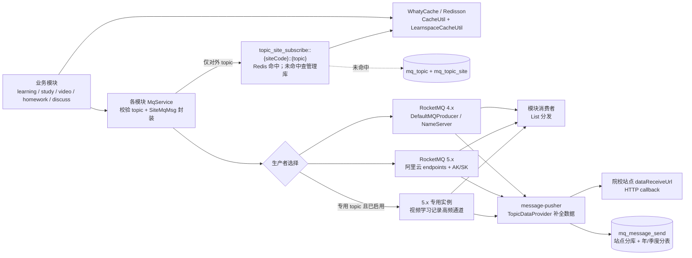

**Redis 的四类职责**：

| 职责 | 代表 key / TTL | 处理模式 |
|---|---|---|
| 查询加速与配置快照 | 站点/课程设置、课程目录、location、用户班级、资源时长、视频签名、机器人配置；TTL 按业务设置，部分无 TTL | 手工 cache-aside：`get → 查库 → put`；数据变更后显式 `remove`，没有依赖 Spring Cache 注解 |
| 学习热状态 | `learn:new-watch-record:{10分钟时间片}:{siteCode}:{userId}:{courseId}:{itemId}` 24 小时；用户物理时钟和 reportSeq 7 天 | Redis Hash 保存累计时长、位置、终端、最近落库时间；跨时间片迁移，接口重试与乱序请求可直接返回缓存结果 |
| 防重、限流与短凭证 | MQ messageId/uniqID 1~2 小时，pageToken 60 秒，短信验证码 5 分钟、短信冷却 60 秒，学习上报频率记录 5 分钟 | 共享状态让多实例看到同一结果；MQ 标记在业务处理成功后写入，重复消息直接确认成功 |
| 状态机与容错 | 知识图谱 running/success/failed、AI 视频总结/自动填补/课程生成、AI 熔断失败计数默认 10 分钟、半开锁默认 30 秒 | Redis 不只是结果缓存，还承载异步任务状态、熔断窗口和防重入状态；TTL 负责异常退出后的自动恢复 |

缓存 key 的主维度通常是 `siteCode + courseId + userId/itemId`；少量与域名绑定的能力再加 `host`。这使同一个 Redis 集群可以服务多个院校、多课程和多实例，但也意味着**写路径必须精确清掉所有逻辑 cache 下的关联 key**。例如站点 Topic 订阅缓存使用无 TTL 的 `put`，由 `open-api/SiteController.clearSiteCache` 遍历 Topic 枚举主动失效；课程设置和 SDK 批量写接口则需要同时清 `CacheUtil` 与 `LearnspaceCacheUtil`。

**MQ 生产端：统一接口、双客户端与专用通道**

各业务模块都定义小型 `MqProducer` 接口，向上只暴露普通消息、延迟消息、客户端类型和初始化状态；`MqConfiguration` 按以下优先级选实现：

```text
ROCKETMQ_CLIENT_TYPE 环境变量
    > {module}-mq.client-type 配置
    > legacy 默认值
```

- 4.x 实现使用 `DefaultMQProducer + nameServer + producerGroup`，延迟消息直接写 RocketMQ delay level。
- 5.x 实现使用 endpoints、namespace 与会话凭据，延迟级别经 `CommonUtils.getDelayDurationByLevel` 转换成绝对 `deliveryTimestamp`，保持调用方语义不变。
- `study`、`video` 和 `message-pusher` 还有一套 5.x dedicated 配置。`DedicatedMqTopicEnum` 当前包含学习记录与高频学习时长 topic；生产者选择器优先专用实例，不可用时降级到普通实例。仓库生产 profile 中 dedicated 为开启状态，但仍支持环境变量 `ROCKETMQ_USE_DEDICATED_MQ` 覆盖。
- 跨站点事件统一封装为 `SiteMqMsg { siteCode, body }`。内部 topic 直接发送；对外 topic 先查 `mq_topic/mq_topic_site`，未订阅即视为无需发送，从源头减少无效消息。

**MQ 消费端：Topic 订阅、策略分发与 Redis 幂等**

4.x 消费者用 `DefaultMQPushConsumer`，5.x 使用 `PushConsumer`；两套消费者根据同一个 client-type 互斥初始化，并从各模块 Topic 枚举生成订阅表。Listener 不直接堆叠业务判断，而是注入 `List<MessageConsume>`，逐个调用支持该 topic 的处理器，覆盖成绩计算、资源完成、数字教材、机器人知识库、AI 课程生成、作业批阅和视频进度等任务。

典型消费语义是 **at-least-once + Redis 时间窗幂等**：

1. 取 RocketMQ `uniqID/messageId`，先查 Redis；存在则返回成功。
2. 解析 `SiteMqMsg`，按 `siteCode` 切换站点数据源，再交给 Topic 对应处理器。
3. 业务处理完成后写 Redis 标记，常见 TTL 为 2 小时。
4. JSON 格式错误通常直接确认成功，避免毒消息无限重试；业务异常是否重试由模块 Listener 决定。

这里不是全局 exactly-once：业务副作用完成后、Redis 标记写入前若进程退出，消息仍可能重放，因此核心落库仍需按业务主键或累计值保证幂等。同时，不同模块的异常确认策略并未完全统一：study 的 4.x/5.x Listener 会返回重试，learning 的通用 Listener 捕获异常后仍返回成功。文档不能把“有 Redis 去重”写成“所有消息绝不丢、绝不重复”。

**Redis + MQ 的代表链路：视频观看记录**

这是两套基础设施耦合最深的一条高频链路：

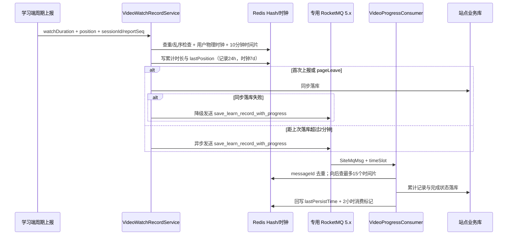

这条链路的设计重点不是简单“把写库改异步”：Redis 先接住高频上报并维护服务端可信时钟；首次与离开页面直接写库保证关键节点及时落盘；周期上报每两分钟异步刷库；同步失败再发 MQ；消费延迟导致原时间片迁移时，消费者会从消息时间片向后搜索最多 15 个时间片。性能、用户离场可靠性和消息延迟三种情况都有单独处理。

**对外消息推送与重试**

`message-pusher` 是独立的反腐/适配层：它消费 `MqOuterTopicEnum`，先用 `TopicDataProvider` 按事件中的业务 ID 补齐最终数据，再根据 `siteCode` 找站点 `dataReceiveUrl`，通过 `CallbackService` 调外部系统。推送成功后写 2 小时 Redis 幂等标记；无论成功、失败或重试，都会记录 `msgId`、父消息 ID、站点、回调地址、Topic、内容、状态与失败原因。

- 4.x 分支捕获可重试 `ServiceException` 后，手工创建下一条延迟消息，并用 `PARENT_MSG_ID` 串联重试链。当前 level 序列 `{4,9,14,16,17,18}` 映射为 `30秒 → 5分 → 10分 → 30分 → 1小时 → 2小时`，共最多 6 次延迟重投。
- 5.x 普通与 dedicated 分支不手工复制消息，而是返回 `ConsumeResult.FAILURE` 交给 Broker 重投；实际最大次数和死信策略由阿里云实例配置决定，源码中没有统一写死。
- `mq_message_send` 通过 ShardingSphere 按 `site_code` 分库、按 `send_date` 年/季度分表，物理表范围预建到 `2035`，解决长期外推日志单表增长问题。

**两张名称相近但职责不同的消息表**：

| 表 | 本仓库中的职责 | 边界 |
|---|---|---|
| `mq_message` | 业务事务中写入 PENDING 任务，类型包括作业成绩、资源完成率、学习时长、云视频信息等 | 当前仓库只找到写入服务和状态模型，未找到轮询执行器；它是数据库任务队列/Outbox 的写入端，不能仅凭本仓源码声称完整消费闭环 |
| `mq_message_send` | message-pusher 的外部 HTTP 投递审计与失败留痕 | 它不是 Broker 死信队列；4.x/5.x 重试仍由各自 Listener/Broker 机制完成，表只负责可追踪性和人工排查 |

**当前实现边界与运维注意点**：

1. 多个 Producer 在配置缺失、未初始化时会记录日志并按“软关闭”处理，部分实现甚至返回 `true`。这保证本地或无 MQ 环境能启动，但调用方不能仅凭 boolean 断言消息一定进入 Broker。
2. Redis 位于 pageToken、短信限流、学习时钟和 MQ 幂等的关键路径，不是完全可丢的查询缓存。仓库多数调用没有统一的 Redis 熔断/降级层，Redis 故障的影响会因业务链路不同而扩大。
3. Topic 订阅缓存、部分站点/课程配置使用无 TTL 缓存，正确性依赖变更事件主动清理；新增写接口时必须同步梳理所有 cache namespace 和 key。
4. 4.x 与 5.x 的延迟、重试和异常确认语义只做了接口层兼容，没有形成全模块一致策略；迁移验证应按 producer/consumer/topic 逐条进行，不能只验证客户端能连接。
5. 部分环境配置文件包含连接地址和凭据字段，扫描时还发现了源码内明文敏感配置。本文不记录任何具体密钥；上线治理应改为密钥中心或环境变量注入，并轮换已进入版本历史的凭据。

**关键源码索引**：

| 文件 | 作用 |
|---|---|
| `learnspace-common/.../cache/CacheUtil.java` | 公共 cache namespace、KV/Hash API、公共 key 工厂 |
| `learnspace-common/.../cache/LearnspaceCacheUtil.java` | 课程空间 cache namespace、学习与课程设置 key 工厂 |
| `learnspace-*/src/main/resources/redis.yaml` | Redisson 单机连接池与 Maven profile 占位配置 |
| `learnspace-common/.../enums/MqTopicEnum.java` | 55 个公共 Topic 的白名单与说明 |
| `learnspace-common/.../enums/DedicatedMqTopicEnum.java` | 专用 RocketMQ topic 路由集合 |
| `learnspace-learning-service/.../mq/config/MqConfiguration.java` | 4.x/5.x Producer 选择模板 |
| `learnspace-study-service/.../mq/selector/DefaultMqProducerSelector.java` | 普通/专用 Producer 路由与降级 |
| `learnspace-study-service/.../mq/consumer/DedicatedMessageListener.java` | 专用消息 Redis 去重与失败重试信号 |
| `learnspace-study-service/.../service/impl/VideoWatchRecordServiceImpl.java` | Redis 学习时钟、时间片、同步/MQ 持久化决策 |
| `learnspace-study-service/.../mq/consumerservice/impl/VideoProgressConsumerImpl.java` | 视频进度时间片查找、落库与 Redis 回写 |
| `learnspace-message-pusher/.../consumer/MessagePushMessageListener.java` | 4.x 外推、手工延迟重试和投递留痕 |
| `learnspace-message-pusher/.../consumer/AliMessagePushMessageListener.java` | 5.x 外推与 Broker 重试信号 |
| `learnspace-common/.../config/datasource/DynamicDataSourceRegister.java` | `mq_message_send` 分库分表规则 |
| `learnspace-common/.../service/impl/MqMessageServiceImpl.java` | `mq_message` 数据库任务写入端 |

### 4.2 业务线 A：答疑评论公开机制改造（跨 4 仓库全链路）

这是他最有代表性的一条需求，横跨 admin-api → admin-web → rest-api → discuss-web，是典型的端到端需求负责人工作。

**原逻辑**：学生提问后进入「待筛选」，教师只要点击回复，被回复的评论就自动变公开（**回复 == 公开**）。

**改成**：引入 `auto_publish_on_reply` 开关，把「回复」和「公开」解耦。开关关闭时教师回复后评论仍不公开，需再手动点「设为公开」；开关开启时保留旧行为。默认值经历过一次调整：最初默认 `"0"`（仅手动公开），07-01 与 07-07 两次改为 `"1"` —— **保持向后兼容不影响存量站点**。

**配置落地链路（四层）**：

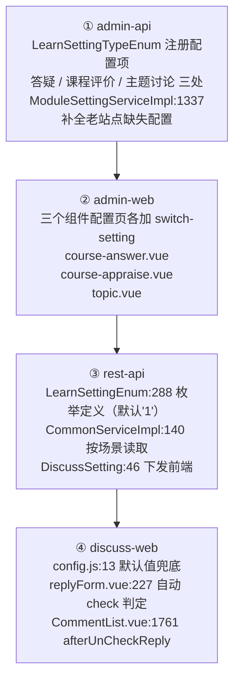

**一处值得记录的架构演进（自我推翻）**：`f5f42aaac`（07-06）第一版把开关做成**全局**的 —— 所有业务场景都从答疑组件 `course_answer` 记录里读，注释写明"避免前端回退到默认值"。**次日** `67f33eaa5`（07-07）推翻这个设计，改为答疑/评价/主题讨论**各读自己的设置记录、互相独立**。同一次提交还修掉一个真 bug：`CommonController.java:44` 原来无条件 `setBusinessCode(VIDEO.getCode())`，硬编码成 VIDEO，改为 `componentBusiness.getCode()`。

**衍生问题一：教师端未处理评论的层级显示**
开关关闭后出现新问题 —— 教师回复了但父评论未公开，「未处理」列表原先不区分一二级平铺展示，教师看不到自己的回复。改法是**按线程（一级评论）分页**：

- `DiscussCommentMapper.java:152-172` 新增 `queryUncheckedPrimaryCommentByPage` 与 `queryUncheckedSubComment`
- `DiscussCommentMapper.xml:385` 一级评论线程查询，用 EXISTS 判断线程内是否存在 `flag_is_check = 0` 的在组评论；`:425` 子评论查询**刻意不用 `flag_primary_active` 过滤**，保证未公开子评论也返回
- `DiscussCommentServiceImpl` 约 652 行起：主查一级 + 批量查子评论 + `computeIfPresent` 组装父子层级，并对 authorName 做脱敏
- 前端 5 处以 `setting.autoPublishOnReply !== '1'` 为条件渲染二级评论区（PC 两个 tab + mobile 两个组件）

这个层级显示他调了三次（加、修判断条件、继续修 mobile），说明双端 + 教师/学生 + 多 tab 的组合场景比较绕。

**衍生问题二：公开评论数量对不上**
开关关闭后，父评论未公开但教师的二级回复 `flag_is_check=1`，导致数量统计把它计入、列表却不展示。修复在 `DiscussCommentMapper.xml:492` 与 `:665` 两处 count 查询，加 EXISTS 子查询要求父评论对当前用户可见（`pri.comment_author_id = #{userId} OR pri.flag_is_check = 1`）。

**其他收尾**：未处理数量角标（`CommentList.vue:152` 红色计数）、未公开 tab 下不显示老师标识的 bug、答疑公开提示文案。

一个观察：**主需求 1 次提交，衍生 bug 追修 4 次、连续 5 天**。这条线体现的是把需求真正做完的收尾能力。

### 4.3 业务线 B：SDK 对外开放接口

**SDK 给谁用**：`learnspace-sdk-client` 是发布到私服（`maven.webtrn.cn`）的 Java 客户端 jar，给**业务系统 / 院校方教务主系统**集成 —— 业务系统作为教务主系统，通过 SDK 调课程空间的能力。三层结构：

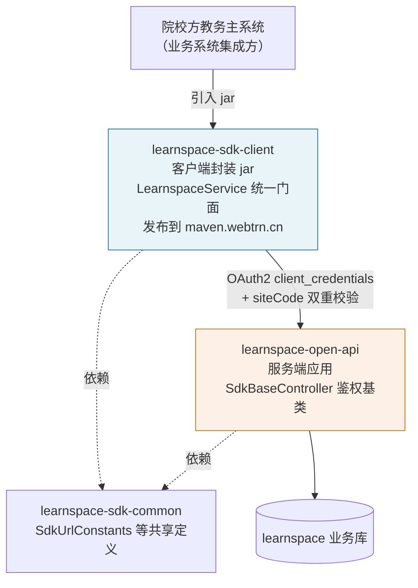

**鉴权方式**：OAuth2 `client_credentials` + **siteCode 双重校验**。客户端配 `learnspace-sdk-client.yaml`，含授权服务器地址、资源服务器地址、每站点的 clientId/clientSecret（也支持从 `pe_web_site` 表的 `sso_app_id`/`sso_app_secret` 动态取）。服务端 `SdkBaseController.java:26-40` 的 `getAndVerifySite` 强制校验请求参数里的 siteCode 与当前 OAuth2 认证主体的站点一致，不一致抛 `CURRENT_AUTHENTICATION_NO_ACCESS` —— **防止 A 站点凭证越权操作 B 站点数据**。他新增的每个接口都规范地调用了这个方法。

**learnspace-doc2 是什么**：VitePress 静态文档站，`docs/sdk/README.md` 是单文件 5800+ 行的 SDK 全量文档，配 flexsearch 全文搜索。文档写法固定：接口 Java 签名 + 参数说明 + 请求 DTO + 带 `##` 行内注释的 JSON 返回示例。他的 4 次 doc2 提交全部只改这一个文件，**与 rest-api 的 SDK 提交严格一一对应** —— 每开发一个接口就同步补文档。

**四组接口**：

| 接口 | 时间 | 内容与技术要点 |
|---|---|---|
| **三个批量配置接口** | 06-23 ~ 07-06<br>（迭代 4 次） | `batchUpdateCourseTemplate`（批量更新课程模板）、`batchSetSpeedSwitch`（批量设置不允许倍速）、`batchSetDragSwitch`（批量设置防拖拽）。公共逻辑抽 `doBatchSetCourseSwitch`；配 4 个测试类；`e7a7bdf8c` 明确记录一条安全修复 —— **补 courseId 校验**（批量接口不校验 courseId 归属会造成跨课程越权写入）；`838f1354d` 同步升三个 pom 版本号发版 |
| **getTestScore 增加时间字段** | 07-17 | `TchStuElectiveMapper.xml:359` `LEFT JOIN test_exam_history`，取 `START_EXAM_DATE` 与 `EXAM_TIME`，DATE_FORMAT 统一格式。用 **LEFT JOIN 而非 INNER JOIN** —— 无考试历史记录的成绩仍需返回 |
| **getStudentLearnRecord 增加终端类型** | 08-03 | Mapper 补 `terminal_type`，`LearnRecordManageServiceImpl` **四个分支**（四种轨迹拼装场景）各补一次 put |
| **queryStudentLearningTrack 学习轨迹** | 08-10 | 返回**未聚合的原始单次学习记录**，与已有聚合接口区分定位。`LearnRecordMapper.xml:28` 根据 itemId 是否传入**动态切换 FORCE INDEX**（传了走 `idx_learn_video_study_record_1`，没传走 `i_ssoUserId`）—— 说明遇到过 MySQL 选错索引的性能问题。客户端侧就做非空前置校验，快速失败不发无效请求。文档明确写了 terminalType 取值含义（0 pc / 1 app / 2 其他 / 11 后端程序生成 / 12 后端补偿轨迹） |

**这条线的输出正是 site_cost 的输入侧数据**：学习轨迹、学习时长、终端类型 —— 在 learnspace 是教学结果，在 site_cost 是成本分母。

### 4.4 业务线 C：知识图谱构建异步化

**原问题**：`oneClickGenerate` 全程同步 —— 查 MySQL 章节目录 → 抽取知识点与关系 → 写 Neo4j，全在请求线程里。课程内容多时图库写入耗时长，接口超时、界面卡死无反馈。

**方案**（`KnowledgeServiceImpl.java:122` 起）三个要点：

1. **MySQL 查询保留在主线程**，只把图库写入丢进 `ThreadPoolTaskExecutor`。注释点明原因：**异步线程不继承动态数据源上下文** —— 这是多站点动态数据源架构下异步化的关键约束，整块搬进异步线程会连错库。
2. **状态机 + 防重**：Redis 存 `oneClickGenerateStatus::{siteCode}:{courseId}`，三态 running/success/failed，**TTL 30 分钟兜底**防止异常时状态残留导致课程永久无法再生成。进入时若已 running 直接抛「正在生成中」，挡住连点和多标签页重复触发产生重复节点。

   这是他在 learnspace 侧唯一一处**自己设计 Redis 用法**的地方（其余都是清缓存），四个设计点都指向同一个问题「异步化之后，状态放哪、谁来兜底」：

   | 设计点 | 代码 | 解决什么 |
   |---|---|---|
   | key 带 siteCode + courseId | `KnowledgeConstants.getOneClickGenerateStatusCacheKey(siteCode, courseId)` | 多站点隔离，A 站点的生成状态不影响 B 站点同名课程 |
   | 三态而非布尔 | `GENERATE_STATUS_RUNNING/SUCCESS/FAILED` | 失败要能与「没跑过」区分，否则前端无法提示重试 |
   | 写入即带 TTL 30 分钟 | `ONE_CLICK_GENERATE_STATUS_EXPIRE = 30 * 60`，三次 `CacheUtil.put` 全部传 TTL | **进程崩溃或异常路径漏改状态时自动解锁** —— 没有这个兜底，一次意外就让该课程永久无法再生成 |
   | 查不到时返回 success | `status == null ? GENERATE_STATUS_SUCCESS : ...` | 历史数据（异步化之前生成的图谱）Redis 里没有记录，若返回 failed 或 running 会把老课程卡住；交前端按知识点数量判断实际情况 |

   **「查不到 → 视为成功」这个默认方向值得与他 8 月的权限系统对照看**：权限那边是「读不到 → 拒绝」（fail-closed），这边是「读不到 → 放行」。方向相反但都对 —— 权限读不到时放行是安全漏洞，任务状态读不到时拒绝则是把存量数据全部卡死。**判断依据是「错误的代价落在哪一侧」，不是套用同一个默认值。**
3. **新增状态查询接口** `/oneClickGenerateStatus`；原接口返回文案由「生成成功」改为「已开始生成」。状态查不到时返回 success，交前端按知识点数量判断（避免历史数据卡住）。

**分批写入**（同日晚些，`778b54aa1`）—— 异步化后暴露第二个问题：单事务数据量过大时图库批处理超时并整体回滚。

- `GRAPH_BATCH_SIZE = 50`，用 `CollUtil.split` 分批提交；**节点全部写完后再分批写关系**（关系依赖节点已存在，顺序不能反）
- 同时把 `KnowledgeRepository.java:42-43` 的 Cypher 从 `CREATE (start)-[r:Knowledge]->(end)` 改为 `MERGE`。**这一改很关键**：CREATE 在分批重试场景下会产生重复关系，MERGE 保证幂等 —— 把分批引入的重试风险一并处理掉了。

**前端配套**（`KnowledgeGraph.vue`，+282 行）：进度弹窗（不可点遮罩关闭）、轮询状态接口、模拟进度条、已用时/预估剩余、7 条轮播趣味提示。典型的「异步化后补用户体验」—— 后端无法给出真实进度，用估算 + 文案轮播填补等待感。

### 4.5 业务线 D：学习数据可信性加固

围绕「学习时长/成绩数据可信」的一组同源加固：

**① 限制视频单次提交时长**（08-06）
`VideoStudyRecordServiceImpl.java:486-492`，阈值 `300 * 2 + 5` 秒（注释「5分钟+二倍速+5s」，即前端 5 分钟一次上报 × 最大二倍速 + 5 秒容差），超限记 info 日志并返回 `submitLimited`。

要点：这是**服务端**校验，**不信任前端上报的 studyTimeLong**，防止篡改请求刷学时；放在 IP 校验之前，属最外层快速拒绝。

**② 云端直播时间不能跨天**（07-10）
新增 `crossDayCheck`，仅对云端直播（`type === 3`）生效，改 4 个文件 + 中英文案。注：这是纯前端校验，服务端约束不在此次提交范围。

**③ 自测成绩重算定时任务**（07-30，全仓库他唯一一笔，一次性交付 15 文件 480 行）
扫描源表有已批改测试成绩、但汇总列 `score2` 为空的选课，逐条调重算接口修复。

`@XxlJob("recomputeTestScoreJobHandler")`，独立包分五层：`async/RecomputeTestScoreTask`、`service/impl`、`client/CourseScoreRepairClient`、`config`、`bean`，配独立日志 appender + 单测。目标数据源硬编码 `learn_7th` + gxwgy 站点 —— **针对特定站点的一次性数据修复任务**。

这是他所有提交里工程规范性最完整的一笔：分层、异步、结果统计（异常/成功/失败条数）、独立日志、单测齐全。规格明显高于任务本身的必要程度 —— 既是优点（可维护、可观测），也说明他倾向按标准分层而非按任务体量裁剪方案。

**④ 课程发布时清理缓存**（08-10，当前 HEAD）
`CourseManageServiceImpl.java:2405-2411`，SDK 批量更新课程后按 `courseId + "_info"` 清 `CacheUtil` 与 `LearnspaceCacheUtil` **两套缓存**。修的是「SDK 改了课程发布状态但课程空间读缓存看不到」的一致性问题。

**learnspace 里为什么要清两套缓存**（`CacheUtil` 和 `LearnspaceCacheUtil`）：这是同一份课程数据在两个缓存实现里各有一份的遗留问题，`CacheUtil` 是平台级通用缓存，`LearnspaceCacheUtil` 是多站点场景的专属封装（key 命名带 siteCode）。两套缓存的存在是历史原因，清理时必须都清，漏清任何一套都会留下不一致。他在 6 月写的 `batchUpdateCourseTemplate` 里第一次触到这个模式（`:190-192` 和 `:325-329`，最多一次清 6 个 key），08-10 这笔是同一模式在课程发布入口的复现 —— **属于同一坑的复发修补，而不是独立发现**。

注释里没有解释「为什么两套」，这个背景只能从代码历史里推断。但两次清理的 key 命名模式完全一致，说明他在 6 月第一次接触时就搞清了规则，后来只是照规则执行。

### 4.6 业务线 E：站点访问授权配置（admin 后台权限子系统）

> **第一阶段**：`cf3307b`（admin-api，+2011/-8，12 文件）+ `8a5d294`（admin-web，+378/-1，3 文件）/ 2026-08-12
> **第二阶段**：`0d154c71`（admin-api，+420/-103，6 文件）/ 2026-08-12（晚）— 修复事务/数据源冲突
> **第三阶段**：`c58ffed0`（admin-api，+785/-335，6 文件）+ `e64c5964`（admin-web，+713/-169）/ 2026-08-13 — 权限模型重构
> **收尾**：`02e18bd8` / `3d79f8d6` / `36081c0c`（admin-web 三笔页面优化，共 +111/-34）/ 2026-08-13
>
> **这是 learnspace 侧规模最大、迭代最密集的一条线**，三天内完成「建系统 → 修根因缺陷 → 重构权限模型 → 收尾」四个阶段。

#### 第一阶段（08-12 上午）：原权限模型的问题

`admin-api` 是总控台（`learnspace_control` 库），后台人员通过 `sso_user` 登录，角色类型三档：`9999` 超级管理员 / `9998` 站点超管即项目经理 / `3` 普通管理员。

**权限边界只有一层：菜单级**。`pr_role_menu` 决定某角色能看哪些菜单。但一旦拿到「课程空间站点管理」这个菜单，就能看到并操作 manage 库里**全部 1515 个业务站点** —— 因为站点列表 Grid 是无条件的 `SELECT ... FROM pe_web_site`，**没有任何数据范围过滤**。

设计文档记录的现网实测：33 个后台人员中 13 人是 `9999`，20 人是 `9998` 且**全部共用同一个「项目经理」角色**，这 20 人的可见范围完全相同，等于全站点。

#### 实现机制：角色 + 人员双维度数据范围过滤

不是纯基于 role，也不是基于站点归属字段，而是新建两张显式授权关系表：

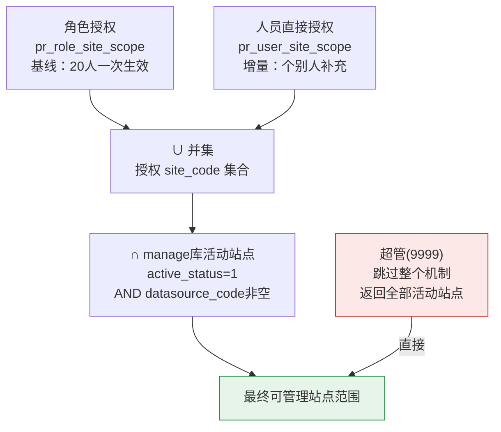

- **角色维度是基线**：给「项目经理」角色配一批公共站点，20 人一次生效
- **人员维度是增量**：给个别人补充额外站点
- 两维度互相独立，撤销一个不影响另一个
- 超管（`9999`）跳过整个机制，返回全部活动站点

选择双维度的理由写在设计文档里：只做角色维度则 20 人范围完全相同无法差异化；只做人员维度则公共站点要重复配 20 遍。

**下放范围明确收口**：覆盖列表查询、搜索、详情、修改、按列更新、刷新 AppSecret、刷新 OAuth 密码；**新增站点与删除站点不下放**，仍锁定超管。

> 「配置授权关系本身只有超管能做」这一条在 08-13 被改掉了 —— 配置页向所有登录用户开放，但只能在自己范围内授权，见后文第三阶段。

#### 技术难点一：数据范围条件如何注入既有 Grid

核心在 `SiteManageServiceImpl.applySitePermissionScope`（`:126-160`），被 `list()` 在调 `super.list()` **之前**调用，保证分页前过滤。

**为什么必须字符串拼接而非命名参数** —— 设计文档给出了**反编译依据**：站点管理 Grid 是 SQL 模式，框架 `GridServiceImpl.list()` 在该分支的实际调用是 `getMapPageBySQL(countSql, sql, new HashMap(), pageSize, startIndex)` —— 参数 map 是**字节码里写死的空 HashMap**，调用方无法注入。框架自带的唯一条件机制也是 `String.replace` 且值取自请求参数。预编译通道不存在。

**注入安全性两道防线**（`SitePermissionServiceImpl.java:243-259`）：进入 SQL 的值全部来自数据库查询结果，不含任何请求参数；再叠加白名单 `^[A-Za-z0-9_-]{1,50}$`，任一不匹配整批抛异常。文档明确说这比框架现有 `${siteCode}`（值直接来自请求）更严格。

**必须深拷贝 GridConfig** —— `GridConfig` 带缓存（`GRID_CACHE_%s_%s` + 角色 code），同角色多用户共用实例。直接 `setSql()` 会让条件在用户间**串用并逐次累加**。

**sql 与 countSql 拼法必须不同**：
- `appendWhere`（`:168-174`）在原 SQL 已有 WHERE 时**外套子查询** `SELECT * FROM (...) permScope WHERE cond` —— 因为原 SQL 可能以 GROUP BY / ORDER BY / LIMIT 结尾，末尾拼 AND 会语法错误，也避免原 SQL 里的 OR 改变优先级绕过条件
- `appendConditionToCountSql`（`:183-192`）**不能**外套子查询 —— 那样只得 1 行、分页总数永远是 1，只能在第一个 WHERE 后插入 `cond AND (`、末尾补 `)`

#### 技术难点二：fail-closed 贯穿全流程

| 场景 | 处理 |
|---|---|
| 取不到当前用户 | 视为非超管，授权集合返回空集 |
| 授权集合为空 | 拼 `1 = 0` 返回空列表，**绝不省略条件** |
| 拿不到 GridConfig / baseSql | 抛 `ServiceException`，**不返回全部** |
| `getRole()` / `getRoleType()` 为 null | 按非超管处理 |
| 站点已关闭或 datasource_code 为空 | 即使有历史授权也不放行 |

「读不到 → 拒绝」而非「读不到 → 放行」，这是权限系统的正确默认方向。对比他 7 月的 `auto_publish_on_reply` 是「读不到 → 默认开启」，方向相反但都是「缺值时必须有明确行为」。

#### 技术难点三：跨库与 AOP 冲突

包名 `com.whaty.learnspace.permission` 的选择是被数据源 AOP 逼出来的：`LearnspaceManageDataSourceCutAop` 的 pointcut 是 `execution(* com.whaty.learnspace.control.service..*.*(..))`，会把 `control.service` 下的一切切到 **manage** 数据源，而授权表在 **control** 库。所以新 Service 必须放在 `control` 包外，并把新包加进 `DataSourceCutAop` 的 pointcut（`:47-48`）。

Service 内部需要访问 manage 库的 `pe_web_site`，用 `inManageDataSource` / `inControlDataSource` 包装（`:628-648`），基于 `MasterSlaveRoutingDataSource.setDbType`，`try/finally` 恢复现场。

**跨库顺序**：两库不能在同一事务内。先在 manage 校验站点，再切回 control 在单事务内 delete + 批量 insert。文档主动记录了两步之间的**时间窗风险**（若此刻站点被删会写入孤立授权记录），并评估为可接受 —— 站点删除低频，且运行时仍校验活动状态，孤立记录只是冗余数据不造成越权。

#### 技术难点四：两个同名表的坑

**两个库都有 `pe_web_site` 表，含义完全不同**：
- `learnspace_control.pe_web_site` 只有 2 条（`control` / `default`，管理端自身，`varchar(20)`）
- manage 库的 `pe_web_site` 有 1515 条业务站点（`varchar(50)`）

授权表的 `site_code` 必须指向 manage 库。设计文档把这个称为「最容易犯的错」，并**明确作废了早期「角色跨站点授权语义矛盾」的结论** —— 那个结论就是基于混淆这两张同名表得出的。

因此两张授权表**刻意不建跨库外键**（manage 库名分环境不同：生产 `kfkc_manage`，dev/test `learnspace_manage`），存在性由 Service 层校验，SQL 脚本末尾专门有一条校验查询确认「未创建外键应返回 0 行」。

#### 越权防护

`checkSitePermissionBySiteId`（`:185-194`）的关键设计：**必须在 manage 库用 siteId 反查真实 code 再校验**，不信任请求体里的 siteCode。

**校验采用两层结构**：Controller 层 6 处校验接入（abstractAdd / abstractUpdate / abstractDelete / deleteSite / refreshAppSecret / refreshOauthPassword），Service 层再兜一层（update / updateColumn / delete），注释写明是「防止其他调用路径绕过 Controller 层校验」。

**异常类型的选择有论证**：刻意**不用** Spring Security 的 `AccessDeniedException`，因为框架的 `ExceptionAdvice` 只对 `MessageException` / `ApiException` / `CustomException` 做定制响应，`AccessDeniedException` 会落到兜底分支返回 HTTP 400 + `SYS_SERVER_ERROR`，前端拿不到可读提示。改用 `ServiceException`（实现 `CustomException`），返回 HTTP 200 + 可读消息。

配置侧防护：目标角色/人员不能是超管（避免「给超管配有限范围」的语义冲突）；所有 siteCodes 必须在 manage 库存在 + 活动 + 有 datasource_code，任一不满足**整批拒绝，不做部分保存**；配置操作有审计日志（记录 operator / target / siteCount）。

#### 前端第一版：权限完全由后端菜单决定

> 以下是 08-12 第一版的形态。08-13 重构后前端从 374 行涨到 995 行、交互模型完全改写，见后文「第三阶段」。

前端改动极小（3 文件），且**没有路由守卫、没有菜单过滤、没有按钮级权限判断**：

- 菜单从 `/core/manager/left/tree` 下发，`permission.js` 的 `setPermissionRouter()` 用 `node.code` 去 `componentsMap` 找组件
- 菜单配置 SQL 只给超管角色插 `pr_role_menu` 记录，非超管拿不到这个菜单节点，页面自然不可达
- **站点列表 Tab 前端一行没改** —— 主列表过滤由后端完成，前端不传 userId 也不自行过滤

新增的配置组件（374 行）是 `el-tabs` 双 Tab（按角色 / 按人员），处理的交互细节包括：1470 站点禁止全量渲染改用 `el-select remote` 远程搜索、已选项必须进 options 否则回显显示裸 code、搜索结果与已选项**合并**防止覆盖导致回显丢失、`saving` 防重复提交、清空后保存也要有明确提示不静默、弹窗开关都清缓存避免残留上一个对象的数据。

一个部署约定：`pe_base_category.code` 必须等于 Vue 组件的 `name`（此处 `learnspace-site-permission-manage`），否则前端匹配不到自定义组件会 fallback 到 `common-grid.vue` 导致页面打不开。

#### 交付物结构

2011 行后端改动中约 1/3 是文档与 SQL：

| 交付物 | 规模 | 内容 |
|---|---|---|
| Java 代码 | 约 1240 行 | 新包 4 类（Constant / Controller / Service / ServiceImpl 680 行）+ 改造 5 个既有文件 |
| `docs/站点权限下放设计.md` | 490 行 | 含现网实测数据、反编译依据、**5 处作废自己早期结论的记录**、本期不包含清单、7 个保持原状的前端文件清单、8 步验证清单 |
| `docs/database/control站点权限.sql` | 约 97 行 | 两张授权表 + 3 条校验查询 |
| `docs/database/control站点权限菜单配置.sql` | 182 行 | 上线前核对（5 条只读查询确认 ID）→ 正式配置 → 配置后校验（3 条）→ **回滚脚本** |
| 前端 | 378 行 | 1 个新组件 + 1 行注册 |

**设计文档里 5 处作废自己早期结论的记录**（这是这份文档最有价值的部分）：

| 早期结论 | 纠正 |
|---|---|
| 把 `getSiteList` 列为主要过滤点 | 入口识别有误，本版已更正 |
| 「角色跨站点授权语义矛盾」 | 基于错误的表对应关系（混淆两个 `pe_web_site`），已作废 |
| 列名 `fk_site_id` | 真实是 `fk_web_site_id` |
| 要求用命名参数注入 | 当前框架版本下无法实现（反编译确认），已作废 |
| overview 接口返回 sites 列表 | 1470 条会拖垮首屏，已移除 |

这些结论都有实测依据（生产只读实例查询）和反编译依据（`admin-api-framework:2.6.5-springboot` 字节码），不是推测。

---

#### 第二阶段（08-12 晚，`0d154c71`）：跨库事务把校验查错了库

第一版落地后立刻暴露一个必现 bug：**在页面上配置任何真实站点，都报「站点不存在、已关闭或未配置数据源」**。表面像数据问题，根因在 Spring 事务与动态数据源的交互。

**根因链**（注释写在 `SitePermissionServiceImpl.java:53-75`）：

```
TransactionConfiguration.txAdvice() 切面
  execution(* *..service..*.*(..)) + 方法名前缀 save*/add*/update*/del*/remove*/do*
    → saveRoleSites 命中，整个方法被包进一个事务
      → HibernateTransactionManager 在事务内第一次取连接后，把连接绑定到线程
        → MasterSlaveRoutingDataSource.determineCurrentLookupKey() 只在 getConnection() 时调用一次
          → 之后再调 setDbType() 不再生效
            → 方法内先查 control 库校验角色（连接被钉死在 control）
              → 再"切"到 manage 库校验站点，实际仍查 learnspace_control.pe_web_site
                → 那张同名表只有 control/default 两条 → 任何业务站点校验不过
```

**这正是第一版「两个同名 `pe_web_site`」那个坑的第二次发作** —— 第一次是设计阶段认知层面的混淆（写在设计文档里作废掉的早期结论），第二次是运行期被事务机制无声地重现。

**修法有三点，都反映对框架机制的准确定位**：

1. **方法改名规避切面**：`saveRoleSites` → `replaceRoleSites`、`saveUserSites` → `replaceUserSites`。不是改切面配置（会影响全仓库 49 处），而是让本方法名避开 `save/add/update/del/remove/do` 前缀，使校验阶段在事务外执行 —— 每次查询各自取连接、尊重当前 dbType。
2. **写操作单独用 `TransactionTemplate` 包**：注入 `@Qualifier("hibernateTxManager")`，自行构造 `PROPAGATION_REQUIRED` 模板，只把 DELETE + 批量 INSERT 包进事务，保证全量替换的原子性不丢。
3. **顺序被写成注释固定下来**：`inControlDataSource(() -> writeTxTemplate().execute(...))` —— **先切数据源再开事务**。注释明确写「连接在事务开始时绑定，顺序颠倒会写错库」。

`TransactionTemplate` 用 `volatile` 字段延迟构造，注释说明了理由：**类内用字段注入（与仓库其余 49 处一致）所以不能在构造器里建模板**；单例竞态下最坏多建一个等价对象，无副作用 —— 显式论证了为什么这里不需要加锁。

**同期还发现并修了一个"菜单能显示但接口全 403"的问题**，根因在框架的 URL 鉴权链路（记录进设计文档）：

```
OAuth2ServerConfig 里 /control/** 没有 antMatchers 规则 → 落到 anyRequest().denyAll()
唯一放行途径：accessDecisionManager 的 UrlMatchVoter
  取 CustomUserAuthenticationToken.getUrlGrantedAuthorities() 逐条 AntPathRequestMatcher 匹配
    url 来源：pr_role_menu → pe_pri_category → pe_base_category
              → pr_base_category_interface → pe_interface.url
```

所以新增 `/control/sitePermission/**` 必须在 `pe_interface` 注册记录并通过 `pr_base_category_interface` 挂到菜单定义上，否则前端表现为「加载站点权限配置失败」。**这条结论修正了第一版设计文档里「不依赖菜单 URL 权限」的表述** —— 菜单权限不是安全边界（这个判断没错），但它是接口的**放行条件**，两者都必须配。

**菜单挂载位置也改了**：从「站点管理下的第三个 Tab」改为与「课程空间站点管理」同级的二级菜单（`show_in_left_menu='1'`）。理由写在 SQL 注释里，是实测得出的：站点管理下的 6 个子节点 `show_in_left_menu` 全为 `'0'`，入口是站点列表 Grid 的**行级按钮**（`grid_menu_config` 中 `show_type='column'`），点某一行站点才能进去并带上 `siteCode`；而站点权限配置是**全局配置页，不属于某一个站点**，不该走行级按钮。

配套还新增了 `docs/database/control新增项目经理账号.sql`（109 行），用于建测试用的项目经理账号。这份脚本值得单独一提 —— 它把**框架登录机制逐条讲清了**：密码是无盐单次 MD5 32 位小写 hex（用 `md5sum` 与 MySQL `MD5()` 交叉验证过）、`site_code` 必须是 `'control'`（登录 SQL 带该条件且唯一键是 `(LOGIN_ID, site_code)`）、`FLAG_ISVALID`/`FLAG_BAK` 留 NULL（有指向 `enum_const` 的外键，填错值直接报外键错误）、密码取值满足 `Constant.userPasswordPattern` 以免用户改密时被卡。含事务包裹、`NOT EXISTS` 防重、3 条执行后校验、回滚语句。

---

#### 第三阶段（08-13，`c58ffed0` + `e64c5964`）：权限模型重构

这一笔不是优化，是**把权限模型换掉了**。前一版能用之后，暴露出模型本身的两个问题：配置页只有超管能进（20 个项目经理无法自助）、保存是全量替换（并发配置互相覆盖、且必须一次提交完整集合）。

**变更一：从「仅超管可配置」到「所有登录用户可配置，但只能在自己范围内」**

| | 第一版（08-12） | 重构后（08-13） |
|---|---|---|
| 谁能进配置页 | 仅超管（`checkSuperAdmin`） | 所有登录用户 |
| 能授出什么 | 超管授任意站点 | **只能授出自己已有的站点** |
| 安全边界在哪 | 超管身份判定 | **服务端逐个校验站点是否越界** |

这是**权限委派模型**（delegation）：项目经理可以把自己管的站点再分给下属，但授不出自己没有的。核心防线是 `checkWithinOperatorScope`（`:847-857`），注释把风险讲得很直接：

> 页面对所有登录用户开放后，这是唯一的权限提升防线：请求体里的 siteCodes 完全由客户端控制，只靠前端列表过滤等于没有校验。

三处配套设计都是围绕**防权限提升**：

- **未管理列表（可授权候选池）收窄到操作者范围**（`listUnmanagedSites:530-568`）—— 不让操作者在界面上看到超出自己权限的站点。`operatorScope` 为空时**直接返回空页**，注释明确「绝不能跳过这个分支，否则下面不拼 IN 条件就等于放开全部站点」。
- **已管理列表刻意不收窄**（`listTargetSites:475-483`）—— 被配置对象的既有授权必须完整可见，否则超出操作者范围的历史授权在页面上不可见也无法撤销。这是**两个列表故意用不同规则**，且写明了各自理由。
- **撤销也要校验范围**（`revokeSites:797-802`）—— 否则任何登录用户都能剥夺他人的站点权限。但**超管跳过这层校验**，理由是 `getAuthorizedSiteCodes` 只返回活动站点，已关闭/已删除站点的脏授权不在其中，若一并校验就再没人能清理这些残留记录。

**变更二：全量替换 → 增量 grant / revoke**

接口从 `saveRoleSites` / `saveUserSites`（各自全量覆盖）改为 `grantSites` / `revokeSites`（`targetType` 参数区分 role/user，两类合并成一对接口）：

| 维度 | 全量替换 | 增量 grant/revoke |
|---|---|---|
| 请求内容 | 完整的最终集合 | 只传本次要加/要减的 |
| 并发配置 | 后提交的覆盖先提交的 | 互不影响 |
| 重复提交 | 幂等（结果相同） | 已授权的自动跳过（`grantSites:746-753`），避免唯一键冲突导致整批失败 |
| 返回值 | 无 | **实际影响条数**（已存在的不计） |

`revokeSites` 有一处口径选择值得记录：**撤销不校验站点在 manage 库是否存在或活动**（`:788-790`）—— 已关闭或已删除站点的历史授权同样要能清理，否则脏数据永久残留。这正好回应了第一版设计文档里「授权表 site_code 没有清理机制」这条被归类为「可接受」的遗留项 —— 现在它有清理入口了。

**变更三：`overview` 一次性返回 → 四个分页接口**

第一版 `overview` 一次返回全部角色 + 全部人员及各自站点数。重构为按需分页：

| 新接口 | 用途 | 分页 |
|---|---|---|
| `/roleList` | 按角色配置 Tab 主列表，支持角色名/角色类型搜索 | 默认 10，上限 100 |
| `/userList` | 按人员配置 Tab 主列表，支持账号或姓名/所属角色搜索 | 默认 10，上限 100 |
| `/targetSites` | 弹窗内站点列表，`managed` 参数切已管理/未管理，支持站点名/编号/类型/数据源编号四条件 | 默认 10，上限 50 |
| `/dictionaries` | 站点类型 + 角色类型字典，避免前端硬编码枚举 | — |

`TARGET_LIST_MAX_PAGE_SIZE = 100` 的取值有注释：「为了让前端能一次拉全角色用于『所属角色』下拉（现网 6 个角色、33 个人员）」—— **上限值是按现网实际数据量定的**，不是随手取的整数。

**一处分页策略的差异化选择**（`listManagedSites:486-492`）：已管理列表在 **Java 内存分页**而非 SQL 分页，理由是「需要把授权记录存在但 manage 库查不到的孤立 code 一并列出来供撤销，这类 code 在 SQL 里根本查不出行，只能在 Java 侧补」，且已授权集合上限就是站点总数（实测 1515），内存分页可接受。未管理列表则走标准 SQL 分页 —— **两个列表用不同分页方式，各有明确理由**。

`toMissingSiteItem`（`:666`）专门为「授权表有记录但 manage 库查不到」的孤立 code 造行，页面标注出来（`exists` 字段）让超管能看到并清理。

**变更四：菜单名从「站点权限管理」改为「站点访问授权」**，SQL 脚本与设计文档同步改。

**服务端实现规模**：`SitePermissionServiceImpl` 从 680 行涨到 **1092 行**，接口从 12 个方法调整为 11 个（合并了 role/user 的成对方法、拆出分页接口）。新增的辅助层包括 `pagedQuery`（统一 count + list + 上限夹取）、`pageInMemory`、`emptyPage`、`toSafeCodes`、`normalizeTargetType`、`matchFilters` 等 —— 分页与过滤被抽成可复用单元，而不是在四个接口里各写一遍。

**前端同步重写（374 → 995 行）**

交互模型从「el-select 远程搜索多选 + 一次保存」改为「主列表分页 + 弹窗内双表穿梭」：

- **主列表分页 + 搜索**：角色 Tab（角色名、角色类型）、人员 Tab（账号/姓名、所属角色）
- **弹窗双表穿梭**：左「未管理站点」右「已管理站点」，各自独立分页与四条件搜索，勾选后批量授权/移除
- **人员 Tab 懒加载**（`:550-552`）：首次切到人员 Tab 才请求。用**独立标志位而不是判断列表长度** —— 注释写明「搜索结果确实为空时长度也是 0，那种情况下不该重复请求」
- **搜索条件变化强制回第 1 页**（`:583`）：否则会停在旧页码上显示空列表
- **列表刷新后清勾选态**（`:712`）：避免拿到旧选中项
- **授权变化后回第 1 页**（`:907`）：已管理列表条数变了，当前页可能越界
- **打开/关闭弹窗都清缓存**：避免闪现上一个角色/人员的数据

**三笔页面优化（10:48 / 11:07 / 11:29）**

不是无关紧要的调样式，每一笔的注释都指向**与项目既有页面的一致性**或**框架样式冲突**：

| 提交 | 改动 | 注释给出的根因 |
|---|---|---|
| `02e18bd8` | 抽 `grid-like-table` mixin 显式覆盖表格内边距与对齐 | `el-table` 渲染的是真实 `th/td`，会被 `main.css:5100` 的全局裸标签规则 `th,td{padding:8px;text-align:center}` 命中，文字居中后又被 `.cell` 自身内边距推开，与其他列表页不一致。项目内 `.import-container` 是靠显式覆盖 padding 解决的（`main.css:4417`），此处沿用同一手法。勾选框列单独保持居中，否则复选框贴左边 |
| `3d79f8d6` | 操作列移到首列；固定 `width` 改 `min-width`；列间距挪到 `.cell` 的 padding 上 | 「加在 `th/td` 上会与 `el-table` 自身的列宽计算冲突（它按 `td` 宽度分配），加在 `.cell` 上则只影响内容排布」；操作列宽取 110 而非 100 是因为「`.cell` 两侧各 12px 内边距，『无需配置』四字加省略号阈值在 100px 下会被截断」 |
| `36081c0c` | 弹窗表格高度从写死 300 改按视口计算，加 `top="5vh"` | `siteTableHeight` 计算式把弹窗除表格外的占用逐项列出（标题 56 + 搜索区约 86 + 面板标题 34 + 分页 32 + 底部提示与按钮约 72 + 留白），夹在 `[300, 620]`；并说明**只在打开弹窗时算一次、不监听 resize**：「中途改窗口尺寸的场景少，不值得为它引入监听器和清理逻辑」 |

弹窗宽度从 `960px` 改 `90%`，`whaty-dialog-form` 给 body 设的 `max-height:504px`（`dialog-form.vue:154`）被按视口放开 —— 注释说明那个高度限制「是为表单弹窗准备的」，双表格弹窗会超出并出现内层滚动条。

**这三笔的共同点**：都是「改动 3 行、注释 8 行」的形态，每处都写明了**在改谁的样式、为什么这个数值、为什么不用另一种做法**。

---

#### 与 auto_publish_on_reply 改造的手法对比

两次都是「双仓库同步、后端先前端后」（本次 api 11:13:46 → web 11:14:13，间隔 27 秒），前端都走「注册进 customComponents / 复用既有配置组件」路线不碰路由，都遵循仓库既有约定不引入新框架。但性质差别很大：

| 维度 | auto_publish_on_reply（7 月） | 站点权限下放（8 月） |
|---|---|---|
| 变更性质 | 参数化扩展 | **新增子系统** |
| 代码量 | 约 30 行 | 首版约 2400 行，三天累计约 4700 行改动 |
| 提交粒度 | 6 个小提交、跨 7 天迭代 | 首版各 1 个提交同一时刻落地，随后 3 天 6 笔迭代 |
| 新增包/表 | 无 | 1 包 4 类 + 2 张表 |
| 数据模型 | 复用 `learn_setting` key-value | 新建关系表 |
| 数据源 | 单库 | 显式跨库切换 + 手工恢复现场 |
| 设计文档 | 无 | 515 行，含实测数据、反编译依据与作废结论 |
| SQL 脚本 | 无 | 513 行 / 3 个文件，含核对 / 校验 / 回滚三段 |
| 安全模型 | 无 | fail-closed 贯穿 + 注入白名单 + 反查真实归属 + 授权范围委派 |

**最大的手法差异是「先勘探后动手」**。`auto_publish_on_reply` 是在已知结构里加 key，直接改就行，所以呈碎片式迭代（单独改一行正则、单独修配置，发现问题再补）。本次先写 490 行设计文档，把错误结论连同纠正理由一起留在文档里 —— 这在小改动里不需要，在动既有框架的权限模型时是必需的。

**第二个差异是明确的范围收口**。设计文档用整节列出「本期不包含」：菜单管理站点下拉、站点初始化、MQ Topic、Grid 管理、`changeDataSourceBySiteCode` 的 66 处调用链、`/control/siteConfigManage/*`；并逐条列出 7 个保持原状的前端文件。已知风险（`changeDataSourceBySiteCode` 的 fail-open、`/superAdmin/permissionManage/*` 接收前端 webSiteId 的越权面）被**显式记录为后续项**而非默默扩大改动面。

#### 这条线的四阶段节奏

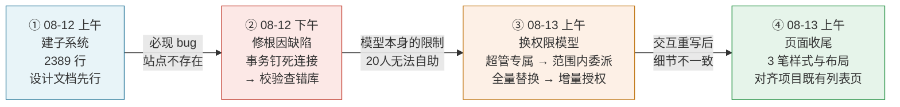

四个阶段的性质完全不同，值得分开看：

- **①是设计驱动**：490 行设计文档先行，含反编译依据与作废结论
- **②是根因驱动**：报错信息（「站点不存在」）指向数据，实际根因在三层之外（切面 → 事务管理器 → 数据源路由）。定位准确的标志是**修法没有动切面配置**（会影响全仓 49 处），而是改方法名 + 自行管理事务边界
- **③是需求驱动的模型替换**：不是加功能，是把「谁能配置」和「怎么配置」两个维度都换了。安全边界从「身份判定」下移到「逐个站点校验范围」—— 开放面变大了，但防线做在了服务端，且注释明确写出「请求体可被伪造，前端过滤不构成安全边界」
- **④是一致性收尾**：三笔小改动全部围绕「和项目里其他列表页看起来一样」，每处注释都指到具体的 `main.css` 行号

**一个可对照的细节**：第一版设计文档把「授权表 site_code 没有清理机制」列为可接受的遗留项；三阶段的 `revokeSites` 刻意不校验站点是否仍存在，正是为了给这类脏数据留清理入口。**遗留项在两天内被自己消化掉了**，且是在做别的重构时顺手带上的 —— 说明那份文档不只是交付物，是他自己在用的待办清单。

### 4.7 时间线

```
06-23  三个批量配置 SDK 接口 v1                        rest-api
06-25  更新倍速、防拖拽接口（+4 个测试）                 rest-api
06-26  测试文件微调 / 三个批量接口 SDK 文档(+91 行)       rest-api + doc2
06-30  答疑：回复不等于公开（需求起点）                   discuss-web
06-30  教师端未处理评论层级显示 + 修判断条件               discuss-web
07-01  答疑组件加 auto_publish_on_reply 配置             admin-api
07-01  答疑配置页开关 UI                                admin-web
07-01  层级显示续修 / 提示文案 / 默认值改开启              discuss-web
07-03  supplementMissingSetting 补全老站点配置           admin-api
07-03  学习时长正则修复 [0-9] → [0-9]+                   admin-web
07-06  三个批量 SDK 接口合并 + 补 courseId 校验           rest-api
07-06  SDK 版本号发版                                   rest-api
07-06  后端 auto_publish_on_reply（全局读取版）           rest-api
07-06/07  前端开关 + 未处理角标                          discuss-web
07-07  课程评价、主题讨论独立配置                         admin-api + admin-web
07-07  改为各业务场景独立读取 + 修 businessCode 硬编码     rest-api
07-08  公开评论数量 bug（前后端）                         rest-api + discuss-web
07-09  未公开 tab 老师标识 bug                           discuss-web
07-10  云端直播不能跨天                                  learning-web
07-17  getTestScore 时间字段 + 文档                      rest-api + doc2
07-21  知识图谱构建改为异步                              rest-api
07-21  分批写入节点 + CREATE 改 MERGE                    rest-api
07-21  知识图谱生成进度弹窗与轮询                         learning-web
07-30  自测成绩重算定时任务（15 文件 / 480 行）            xxl-job-executor
08-03  终端类型字段 + 文档                               rest-api + doc2
08-06  限制视频单次提交时长                              rest-api
08-10  queryStudentLearningTrack SDK 接口                rest-api
08-10  课程发布时清理缓存 / 学习轨迹接口文档               rest-api + doc2
08-12  ★ 站点权限下放首版（+2389 行 / 15 文件）           admin-api + admin-web
08-12  修复配置站点不存在（事务钉死连接 → 校验查错库）      admin-api
08-13  ★ 权限模型重构（范围内委派 + 增量授权撤销）          admin-api + admin-web
08-13  页面优化 ×3（表格样式对齐 / 列序 / 弹窗高度）        admin-web
```

节奏呈**块状推进**：06-23 ~ 07-09 集中在 SDK 批量接口 + 答疑改造两条并行线，07-10 ~ 07-21 知识图谱，07-30 ~ 08-10 数据修复与 SDK 增量，08-12 ~ 08-13 权限子系统（**这一段是全期最密的迭代 —— 三天 6 笔，累计约 4700 行**）。

**分支状态**（需注意）：工作在个人 feature 分支上，且知识图谱这条线**尚未合入 master**。

- rest-api：答疑改造与 SDK 接口在 `dev_lc_feat`（已进 origin/master）；知识图谱两笔仅在 `dev_lc_knowledgegraph`，未合并
- discuss-web：`dev_lc`；learning-web：`dev_lc_knowledgegraph`
- discuss-web 有三笔同名同内容提交，是 rebase/cherry-pick 留下的重复，实际是一次改动
- **admin-api / admin-web 的权限子系统在 `dev_lc`（已推 origin/dev_lc），尚未合入 master**；上线需配合三个 SQL 脚本（授权表 DDL、菜单配置含 `pe_interface` 注册、可选的项目经理测试账号），菜单配置脚本的 ID 依赖需人工核对生产环境。**注意菜单配置脚本在 08-12 有一次实质性调整**（菜单位置改为二级菜单 + 补 `pe_interface`/`pr_base_category_interface` 注册），若已按首版执行过需重跑

### 4.8 角色定位

在每个 learnspace 仓库的提交量占比都很小（rest-api 15 笔 vs 头部 790 笔，约 1.9%），但**提交量在这里不是有效的贡献度指标**。代码形态给出的判断是：

**外部/专项需求负责人（端到端交付型），而非某仓库的日常维护者。** 依据：

1. **横向跨仓库、纵向全链路，而非在单一仓库深耕**。答疑改造一条需求同时动了 admin-api（配置注册）、admin-web（配置 UI）、rest-api（读取 + SQL + 层级组装）、discuss-web（PC/mobile 双端），涵盖枚举定义、配置补全、Controller 修复、Mapper SQL、Vue 组件五个层次。这种「从管理后台开关一路铺到移动端渲染」的形态是需求负责人；模块 owner 的提交通常集中在自己那一层。
2. **每条业务线都自带闭环收尾**。SDK 接口必配单测（5 个 Test 类）+ 必同步 doc2 文档 + 必升版本号发版；答疑改造后连续 5 天追修 4 个衍生 bug；知识图谱异步化后当天补分批写入 + 幂等 MERGE，并同步做前端进度体验。**他交付的是「需求」，不是「提交」。**
3. **SDK 是相对稳定的职责面，但他是增量接口开发者而非框架 owner**。doc2 只有他 4 笔提交但与 rest-api SDK 提交严格一一对应，SDK 的开发-测试-文档-发版这条流水由他独立走完；框架与文档主体（含 `SdkBaseController`）是他人所建。
4. **技术判断力在细节里比提交量更能说明水平**。几处非新手决策：异步化时识别出「异步线程不继承动态数据源上下文」并据此把 MySQL 查询留主线程；分批写入时把 CREATE 换 MERGE 处理重试幂等；批量 SDK 接口主动补 courseId 校验防越权；视频时长限制放服务端且不信任前端上报值；FORCE INDEX 按参数动态切换；LEFT JOIN 而非 INNER JOIN 保证无考试记录的成绩仍返回。同时他也会**推翻自己一天前的设计**（全局配置改各场景独立），说明在与需求方对齐中迭代。
5. **工作在个人分支、部分未合主干**，符合「按需求拉分支、交付后等合并」的协作节奏。

综合：**被派去做边界清晰的专项需求（答疑公开机制、知识图谱性能、学时防刷、SDK 增量接口、admin 权限下放）的独立交付者**，工程规范性偏好明显。

**8 月的权限子系统改变了这个定位的量级**：前四条线都是「在既有结构里加东西」（加配置项、加接口、改异步），而权限下放是**在既有框架的权限模型上新建一个子系统** —— 需要反编译框架字节码确认注入通道、处理 AOP 数据源切换冲突、识别两个同名表的语义差异、设计 fail-closed 的安全默认。交付物结构（490 行设计文档含 5 处作废自己早期结论 + 带回滚脚本的 SQL + 明确的本期不包含清单）与 site_cost 的架构决策方式一致。

**08-12 ~ 08-13 的三天迭代进一步说明了两件事**：

1. **跨层定位能力**。「配置站点不存在」这个报错在业务层看是数据问题，实际根因跨了三层（事务切面 → HibernateTransactionManager 连接绑定 → MasterSlaveRoutingDataSource 只在 getConnection 时取 key）。定位准确的标志不是修好了，而是**修法的选择**：没有改切面配置（会影响全仓 49 处 service），而是改方法名让本方法脱离切面 + 自行用 `TransactionTemplate` 管住写操作的原子性 —— 影响面收在一个类内。
2. **敢改自己两天前定的模型**。第一版把配置权锁定超管，是保守且安全的选择；一天后主动改成「所有登录用户可配置、但只能在自己范围内」，开放面变大，同时把安全边界从「身份判定」重做为「服务端逐站点范围校验」，并在注释里写明「请求体可被伪造，前端过滤不构成安全边界」。**这与 7 月推翻 `auto_publish_on_reply` 全局配置设计是同一种行为模式** —— 都是次日推翻前一天的自己，但这次推翻的是安全模型，需要同时把新的防线补齐才能推。

---

## 五、核心业务的横向串联

三条业务线各自独立，但从「教育业务如何运转」这个角度看是一条完整链路。核实工作证实了比最初描述更强的连接：**三个系统共用同一张物理表** `kfkc_manage.pe_web_site`，这不是概念相似，是同一份数据被三套代码以不同视角操作。

### 5.1 物理连接点：同一张表、三套代码

核实结论（有文件+行号证据）：

| 系统 | 数据源名 | 实际连接的库 | 用途 | 证据 |
|---|---|---|---|---|
| **site_cost** | `control`（名实不符） | **`kfkc_manage`**（只读 RDS） | 读 `pe_web_site` 取 yunyan_code / domain 做 code 匹配 | `application.yml:41-45` |
| **learnspace-admin-api** | `manage` | **`kfkc_manage`**（读写 RDS） | 业务站点 CRUD、新权限子系统的授权范围 | `application-production.yml:14` |
| **learnspace（主服务）** | `manage` | **`kfkc_manage`** | 站点配置、datasource_code 路由、yunyan_code 查询 | `LearnspaceSite.java:31,64` |

三个系统主机域名后缀相同（`.rwlb.zhangbei.rds.aliyuncs.com`）、账号相同，`pe_web_site` 表字段全对齐（`code` / `yunyan_code` / `datasource_code` / `active_status`）。

**一个命名陷阱**：site_cost 把这个数据源起名 `control`，而 learnspace 生态里 `control` 专指 `learnspace_control`（只有 2 条记录的管理端实例表）。`YunyanCodeResolver.java:26` 注释里的 "control.pe_web_site" 按 learnspace 惯例读会得出完全错误的结论。事实上两个仓库操作的是同一张 1515 行的业务站点表，只是从不同端点读写。

**`sta_` 约定的双向印证**：site_cost 的策略4（`"sta_" + siteCode`，`YunyanCodeResolver.java:86`）与 learnspace 主服务的 `getYunyanSiteCode()`（`StatisLog4jUtil.java:148`：优先 `yunyanCode` 否则 `"sta_" + site.getCode()`）规则**完全一致**，两个仓库各自独立实现了同一条降级规则。这是 site_cost 注释所称「云眼站点 code 的常见约定」的来源。

**「课程空间」=「learnspace」的闭合**：site_cost 部门标签 `LEARNSPACE`（`ProductCatalog.java:51`）直接绑定库 `kfkc_manage`（`ProductSiteSyncService.java:80` 调 `fetchLearnspaceSites`，Mapper SQL：`FROM pe_web_site WHERE active_status = 1 AND code <> 'manage'`）——site_cost 统计费用时打上「课程空间」部门标签的，正是来自这张表的那些站点。

### 5.2 端到端业务链：数据流全景

#### pe_web_site 三系统共用

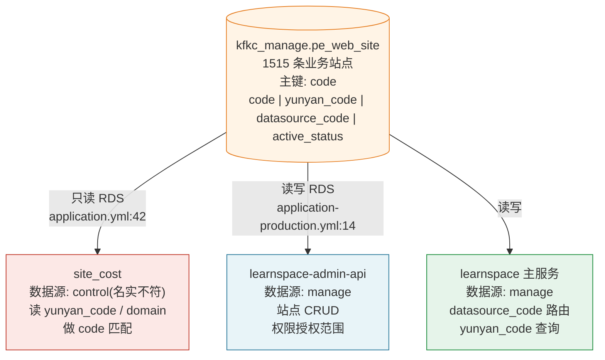

#### 数据流全景：学习时长 → 成本分摊 → 告警

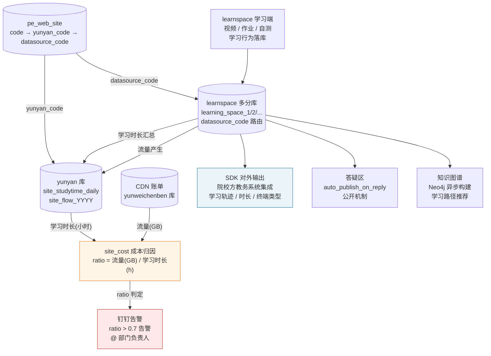

#### qhfx 同期运行（AI 能力试验田）

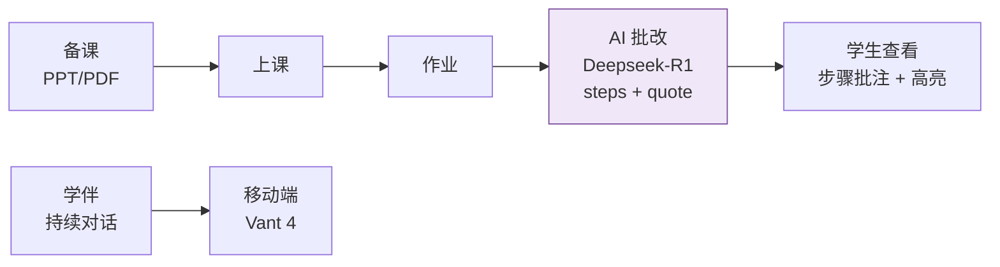

**数据可信链条**（李超在三侧的工作相互支撑）：

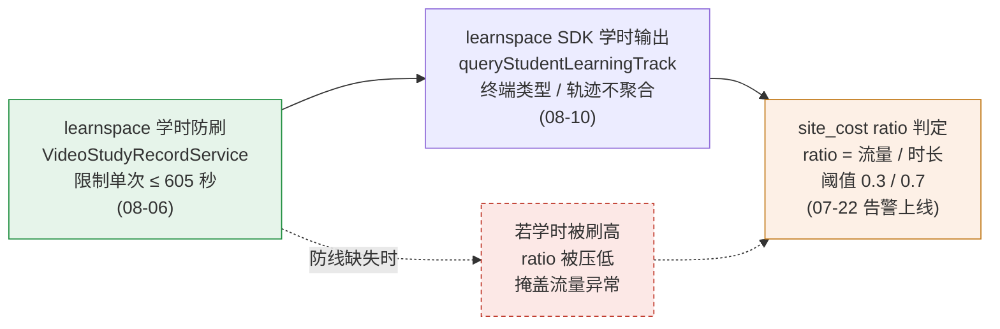

### 5.3 六条贯穿三个项目的技术主线

**主线一：学习时长 —— 同一份数字的三种身份**

`kfkc_manage.pe_web_site` 的每个 `code` 对应一个院校站点，这个站点会产生学习行为，行为数据最终流到两个地方：作为教学结果被 SDK 输出，以及作为成本分母被 site_cost 消费。

| 系统 | 对学习时长做什么 | 具体工作 | 代码证据 |
|---|---|---|---|
| learnspace | **产生**（视频学习上报） | 服务端限制单次提交 ≤ 605 秒，不信任前端上报值，防止篡改请求刷学时 | `VideoStudyRecordServiceImpl.java:486-492` |
| learnspace SDK | **输出**（给院校方教务系统） | `queryStudentLearningTrack` 原始轨迹、`getStudentLearnRecord` 终端类型、`getTestScore` 答题时间 | `LearnRecordMapper.xml:28`、`TchStuElectiveMapper.xml:359` |
| site_cost | **消费**（作成本分母） | 云眼 `site_studytime_daily` 按天入库；bxqk 按时长占比分摊 CDN 流量；`ratio = 流量(GB)/时长(h)` 作异常指标 | `SiteStaIngestService.java:287-304`、`SiteCostAlertService.java:35,38` |

**因果关系**：如果 learnspace 学时被刷高，site_cost 的 ratio 被压低，掩盖流量异常，钉钉告警不触发，CDN 费用超支无人知晓。他在两侧的工作在数据口径上相互支撑——学时防刷（08-06）晚于告警上线（07-22），意味着这个防御是事后补的，但补上了。

bxqk 分摊口径直接体现这个关系：`某站点bxqk分配流量 = bxqk总流量 × (该站点bxqk学习秒 / 全部站点bxqk学习秒)`。**分母里的「学习秒」就是 learnspace 视频学习上报的同一份数字**，从学生端经 learnspace 存入云眼，再被 site_cost 读出来做除法。

---

**主线二：多站点架构 —— 同一个问题的六个侧面**

`kfkc_manage.pe_web_site` 里的 1515 条记录，是 learnspace「一套代码服务多院校」架构的物理体现，也是他在三个系统里反复遭遇同一类问题的根源。六个侧面：

| 系统 | 问题 | 解法 | 代码 |
|---|---|---|---|
| learnspace SDK | A 站点 OAuth token 可能操作 B 站点数据 | 请求参数 siteCode 必须与 OAuth2 认证主体一致，否则拒绝 | `SdkBaseController.java:26-40` |
| learnspace 配置 | 新增 `auto_publish_on_reply` 开关，老站点已有记录里没有这条 | `supplementMissingSetting` 批量补全 | `ModuleSettingServiceImpl.java:1337` |
| learnspace 异步化 | `ThreadPoolTaskExecutor` 的线程不继承动态数据源上下文，异步写图库会连错库 | MySQL 查询留主线程，只把 Neo4j 写入放异步 | `KnowledgeServiceImpl.java:122` |
| learnspace admin | 20 个项目经理共用角色，站点列表 Grid 无条件返回全部 1515 条 | 双维度授权表 + Grid SQL 注入数据范围 + fail-closed | `SiteManageServiceImpl.java:126-160` |
| learnspace admin | 跨库校验被事务钉死连接：先查 control 再"切" manage，实际仍查 `learnspace_control.pe_web_site`（只有 2 条），任何业务站点都报"不存在" | 方法名避开 `save*` 前缀脱离事务切面，校验在事务外跑；写操作单独用 `TransactionTemplate`；顺序固定为「先切数据源再开事务」 | `SitePermissionServiceImpl.java:53-92` |
| learnspace admin | 授权配置只有超管能做，20 个项目经理无法自助分配下属范围 | 权限委派：所有登录用户可配置，但候选池收窄到自己范围 + 服务端逐个校验越界 | `SitePermissionServiceImpl.java:847-857` |
| site_cost | 几百站点共用十几家 CDN，账单只到厂商粒度无法归因 | **这正是 site_cost 存在的理由**；pe_web_site 是起点 | `SiteStaPipelineService.java:40-70` |
| site_cost | 同一个业务站点有三个 code（site_code / yunyan_code / domain_ids），互相不直接对应 | 五策略+存在性校验挽回 252 个未命中站点；normalizeCode 清零宽字符 | `YunyanCodeResolver.java:15-34` |

两个更深的关联：

**site_cost 源数据有且只有「课程空间」的站点使用 `pe_web_site`**（其他 9 个产品用各自的 `pps_*` 同步库）。`fetchLearnspaceSites` 就是从 `kfkc_manage.pe_web_site WHERE active_status=1 AND code<>'manage'` 取数——site_cost 里所有打着「课程空间」部门标签的费用行，背后对应的站点都在这张 learnspace 维护的表里。

**admin 权限下放里的 `filterValidSiteCodes`** 做的一件事是：把授权表里的 site_code 拿去 manage 库校验是否仍然活动（`active_status=1 AND datasource_code IS NOT NULL`）——这和 site_cost 的 `ProductSiteSyncService` 排除关闭站点的逻辑本质相同：两个系统都只关心「当前有效运行的站点」，共用同一个活动状态字段的语义。

`sta_<code>` 约定在 learnspace 侧（`StatisLog4jUtil.java:148`）与 site_cost 侧（`YunyanCodeResolver.java:86`）**各自独立实现，规则完全一致**，是两个仓库之间最直接的隐式约定：learnspace 创造了这个约定，site_cost 跟随了它，两边没有共享代码，靠文档约定对齐。

---

**主线三：AI 能力落地的两种工程挑战**

两个 AI 应用场景看起来差异很大（生成式 vs 结构化），但面对的工程问题有共同模式：

| 维度 | qhfx 智能批改（生成式） | learnspace 知识图谱（结构化） |
|---|---|---|
| AI 输出特点 | 长 JSON，可能被截断；结构需强制约束（字段顺序、quote 精确子串） | 批量节点与关系，写入可能超时回滚 |
| 可靠性处理 | `tryRepairTruncatedJson` 修截断；`ensureCommentAndSuggestions` 兜底；强制 JSON 字段顺序防解析错乱 | 分批提交（BATCH_SIZE=50）；`CREATE` 改 `MERGE` 保幂等，防重试产生重复关系 |
| 用户体验 | 同步调用（120s 超时），等待期前端无特殊处理 | 异步化 + 轮询状态接口 + 模拟进度条 + 7 条趣味提示 |
| 结果持久化 | `grade_result`（三个 JSON 列）+ `grade_annotation`，ai_score 与 final_score 分离 | Neo4j 节点与关系，先批量写节点再批量写关系（顺序不能反） |
| 失败处理 | 持久化异常不影响主流程（catch 后继续返回） | 运行中失败：Redis 状态改 failed，TTL 30 分钟自动清除防永久锁 |

共同模式：**「AI 做不可靠的事，工程代码负责把不可靠的输出变成可靠的持久化结果」**。prompt 工程是降低不可靠性，截断修复和分批幂等是消化剩余不可靠性，状态机和超时是防止不可靠性蔓延。

一条隐性关联：qhfx 用的 `CbbAiClient` 是他建的统一底座（`temperature=0.3, maxTokens=8000`），如果将来 learnspace 也要接入生成式 AI（知识图谱的关系抽取目前不清楚用的是什么），可以复用同一个 client。他同时持有两端的设计知识，这是潜在的迁移路径。

---

**主线四：数据可信 —— 三个系统共同的底层关注**

这条主线的价值在于：三个系统的用户（学生、院校、运营人员）都依赖「数据反映真实情况」，任何一处数据失真都会沿链路传播。

**qhfx（教学结果可信）**
- AI 原始评分 `ai_score` 与教师修改后 `final_score` 分离存储，两个维度都保留，教师不能「假装 AI 给了高分」也不能「强改后看不出 AI 原始判断」
- 批改持久化调用放在主流程之后且异常不影响主流程——宁可成绩丢了需要重批改，不能因为持久化失败让学生看不到结果

**learnspace（学习行为可信）**
- 视频学时服务端上限（605秒）：防刷。`305s = 5min × 2倍速 + 5s容差`，这个公式本身说明他理解了业务场景（前端每 5 分钟上报一次 + 最大二倍速）
- 自测成绩重算定时任务：修历史脏数据（有批改记录但汇总列 `score2` 为空），而不是放任下去
- SDK 接口用 `LEFT JOIN` 而非 `INNER JOIN` 取考试时间——无考试历史记录的成绩仍需返回，不能因联表丢数据

**site_cost（费用口径可信）**
- 真实费用「总账守恒」：Σ 各站点真实费用 = CDN 厂商当天账单总额，每一分钱都有落点
- 孤儿账单显式丢弃并打日志——宁可少算，不能算错，而且必须留痕
- 幂等 upsert + **末位写完成标记**：宁可重算，不能留半成品（「缺天扫描」会把写了一半的天误判为完成）
- bxqk 分母为 0 时不分配也不摊给其他站点：零分母时宁可让那天数据空缺，不能用 0/0 的比例污染其他站点的成本

三个系统的失真传播链：learnspace 学时不可信 → site_cost ratio 失真 → 告警遗漏 → CDN 费用超支无感知；learnspace 成绩不可信 → 院校方教务系统（通过 SDK）同步到错误数据 → 影响学生学籍。这是为什么学时防刷和成绩重算需要在后端做，前端验证不够。

---

**主线五：缓存策略 —— 三个项目、三种取法、各有理由**

这条主线不是「他用了哪些缓存技术」，而是「同一个人在三个场景下选了三种不同策略，且每种策略都说得清为什么」。

**learnspace —— Redis，用框架既有工具，重点是「怎么清」**

平台本身有完整的 Redis 体系（WhatyCache/Redisson、`projectName` 与逻辑 cache name 隔离、`CacheUtil`/`LearnspaceCacheUtil` 两套封装、key 带 siteCode 隔离）。他接入的方式是**用框架工具解决自己范围内的问题**，不重建：

- 知识图谱异步化（`6d5c048ad`）：自己设计了一个 `oneClickGenerateStatus::{siteCode}:{courseId}` 的三态状态机（running/success/failed），TTL 30 分钟兜底防状态永久残留。这是他在 learnspace 侧**唯一一处自己设计 Redis 用法**。
- SDK 批量接口（`e7a7bdf8c`，6 月）+ 课程发布清缓存（`78f2eb215`，8 月）：每次改动课程数据后主动清 `CacheUtil` 与 `LearnspaceCacheUtil` 两套缓存的对应 key（一次最多清 6 个 key）。不需要设计缓存，只需要知道「改了哪里必须清哪里」。

这条线的隐性能力要求其实比它看起来高：learnspace 的缓存 key 命名有命名约定（`getSiteSettingConfigCacheKey`、`getSettingsCacheKey`、`getCourseHeightConfigForTypeCacheKey` 等方法生成），**漏清任何一个 key 或清错 key 都会留下不一致但不报错的静默 bug**。他两次清缓存的 key 集合都对，说明他在接手每个接口前都理解了「这个数据被哪些地方缓存了」。

**site_cost —— 进程内 `ConcurrentHashMap`，刻意不用 Redis**

`SiteStaQueryService.java:104-114` 的缓存是他建的（`605588c` 2026-06-05），TTL 10 分钟，双 key 结构（全量 key 和窄查询 key）让关键字过滤直接走内存而不回源。失效靠 7 处主动 `clearCache()` 调用，10 分钟 TTL 只是兜底。

选进程内缓存而非 Redis 的前提是**幂等全量重算的架构**：任何时候重跑入库流水线结果都是正确的，所以数据一变就立即清缓存（不是等 TTL），而定时入库给了足够低频的「必须重算」触发点。单实例是配套约束，代码注释（`IngestLock.java:34-36`，lizhuang 后加但模式一致）点明：「若将来扩到多实例，需换成数据库行锁或 shedlock 之类的分布式锁」。

**qhfx —— 内存 `volatile` + `ReentrantLock`，AI token 的特殊性**

`CbbAiClient` 的 OAuth2 token 是**进程级凭证**，用 `volatile String accessToken + ReentrantLock tokenLock` 双重检查：无锁快速路径 → 加锁 → 锁内再判（防多线程同时穿过第一关）→ 才真正刷新。提前 60 秒失效避开边界窗口。

不走 Redis 的理由：多实例场景下各自持有 token 代价只是多几次刷新请求，OAuth2 平台允许多 token 并发有效；走 Redis 多一次网络往返且引入「谁来刷新」的协调问题，收益为零。框架层（Sa-Token）本身已经在 Redis 存用户会话，他这里的选择是「这个 token 不是用户会话，不需要跨进程同步」。

**三种选择的共同底层逻辑**：

```
缓存的必要性  = 节省的开销 - 引入的复杂度（一致性 + 运维）
若所有节点都能各自维持正确状态  → 进程内就够了
若数据变化需要跨进程失效        → 需要共享缓存（Redis）
若数据是全量重算且单实例        → 进程内优于 Redis
```

learnspace 那边必须用 Redis 是因为平台多实例 + siteCode 隔离的状态必须多实例共享；site_cost 不用是因为单实例 + 幂等重算；qhfx 的 token 不用是因为各实例独立维持代价可接受。**不是「会不会用 Redis」的问题，是「这里用对不对」的问题。**

---

**主线六：越权防护 —— 从补丁到体系**

三次出现，时间跨度两个月，每次在不同层次：

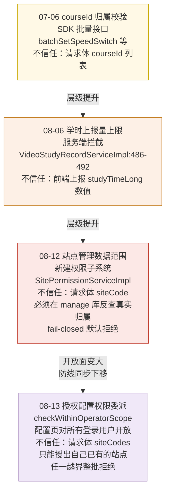

四次的共同模式：**不信任客户端传来的「我有权操作这个资源」的断言，一律在服务端查数据库确认真实归属**。但层级在提升：第一次是补单个字段校验，第二次是限制输入范围，第三次是建立完整的数据范围模型（用两张授权表代替「拿到菜单就能操作一切」），第四次是**在开放配置权的同时把防线做成「授权者不能授出自己没有的权限」**。

第三次技术含量最高，原因是要在**不改框架**的前提下给已有 Grid 注入数据范围条件，而框架的 SQL 参数注入通道在字节码层面不存在。解法（字符串拼接 + 双防线 + 深拷贝缓存隔离 + sql/countSql 不同拼法）的每一步都是为绕过一个框架层面的约束。

第四次是安全模型上最微妙的一次。前三次都是「收紧」：把原本能做的事变成不能做。第四次是**主动放开一个原本锁死的入口**（配置页从仅超管改为所有登录用户），风险方向相反 —— 稍有疏漏就是权限提升漏洞。三处配套设计正是围绕这一点：候选池按操作者范围过滤（界面上看不到）、服务端逐个校验（请求体伪造也没用）、撤销同样受范围约束（不能剥夺他人权限）。注释把这层判断写得很直白：「只靠前端列表过滤等于没有校验」。

同时也有一处**刻意的例外**并给出了理由：超管在 `revokeSites` 里跳过范围校验 —— 因为 `getAuthorizedSiteCodes` 只返回活动站点，已删除站点的脏授权不在其中，若一并校验就没人能清理残留。这是「安全约束与可运维性冲突时，为运维留口子并写明为什么」，而不是笼统放开。

### 5.4 141 次提交与业务价值的对应关系

把全部提交按「解决了什么业务问题」重新组织，而不是按仓库或时间：

#### A. 让 AI 能用（qhfx，04-09 ~ 04-29）

| 提交 | 业务价值 |
|---|---|
| `a102e30` 模块归属重构（181 文件） | 把 AI 功能从独立模块移入主系统，消除部署和依赖隔离，是后续一切 AI 功能的前提 |
| `741d597` CbbAiClient（429 行） | **AI 接入层底座**，四个 AI 消费方全部走同一个 client，统一 token 缓存和错误处理。决定了整个平台的 AI 调用方式 |
| `9399321` `741d597` 备课助手接入 | 教师第一次能用 AI 辅助备课，但 word 导出和 AI 助手未完成（commit 自注） |
| `e138233` / `c5d81a9` AI 批改闭环（同日双仓） | **布置作业→AI 批改→查看批改**首次全程可用。`AiGradingService` 253 行一次成型，`temperature=0.3` 保证输出稳定 |
| `7aa2877` / `82caf79` 智能学伴（同日双仓，1188+324 行） | 学生随时可与 AI 对话答疑，教师可配置学伴行为。25 文件，含方案文档 |

#### B. 让 AI 用得好（qhfx，05-07 ~ 05-28）

| 提交 | 业务价值 |
|---|---|
| `d6a46ed` / `3ed1827` 多 PPT + PPT 转 PDF（同日双仓） | 教师上课可用真实课件而非预制内容；LibreOffice 转换使 PPT 在浏览器可预览 |
| `b9b6ba6` `1fc28c0` 翻页定位两次修复 | 课件翻到哪页、学生看到哪页保持同步——这是课堂实时互动的基础保证 |
| `e5e87e7` / `6837f65` 步骤级批注（同日双仓） | 批改从「整体评分+评语」升级到「每个步骤都有对应」，学生能看到自己哪一步错了。这是 prompt 工程最深的一次改动（`AiGradingService.java:183-218`，要求每步给 quote 精确子串） |
| `9882866` / `ee12ab0` 批改结果持久化（同日双仓） | 批改结果写入 `grade_result`（三个 JSON 列）+ `grade_annotation`，学生可反复查看，不需要每次重新调 AI |
| `d480dbc` / `6c75180` eduRole 角色字段（同日双仓） | 区分教师和学生身份，为移动端角色路由打基础 |
| `ae05a22` 移除 mock 接真实 API | 移动端 35 页从「纯演示」变成「可用」，接口替换 30 页 |
| `a0fb89e` / `24c3f15` 学生端完整闭环（同日双仓） | 学生在手机上可以：查作业→提交→看 AI 批改结果。移动端业务链首次完整 |
| `eae8e0f` 移动端对接方案文档（225 行） | 把「怎么做」写清楚，防止后续维护者走弯路（文档明确列了不该做的事：不要新建 HTTP 工具、不要用 EventSource） |

#### C. 让成本看得见（site_cost，05-28 ~ 08-04）

| 时段 | 提交 | 业务价值 |
|---|---|---|
| **原型期** | `221fc1a` ~ `76a41b4` | 第一次能查到「哪个站点用了多少流量」，数据从无到有 |
| **成型期** | `7f77131` 查询中枢 | 534 行 `SiteStaQueryService`，覆盖站点筛选/部门筛选/导出，是所有查询功能的基础 |
| **性能期** | `605588c` `3333d3b` 并发化 | 9 个远程库串行查改并发，查询从「等很久」到「秒级响应」；等待进度条消失 |
| **架构转型** | `482ed69` 预存储 | **最大的单次改动**：实时跨库 → 离线预聚合 + 本地查询。这之后查询速度、稳定性、可监控性全部质变 |
| **口径可信** | `74f63f9` 真实费用口径 | 从「估算」到「可追溯」：有效单价法保证每个 CDN 池 Σ 站点费用 = 账单总额，运营人员第一次能对账 |
| **数据归因** | `d7fa072` SSO 接入 | 运营人员可登录查看；`812b562` 接入 pps 流水线后每个站点有了明确的业务线归属（课程空间/直播/考试…） |
| **主动预警** | `ddcacb5` 钉钉告警 | 从「需要主动去查」到「异常主动推过来」；`ratio > 0.7` 的站点自动 @ 到部门负责人 |
| **月度收口** | `85d5458` ~ `bf71c59` 月初提醒 | 管理层每月初自动收到上月流量费用汇总，不需要手动跑报表 |

#### D. 让课程空间的学习数据可信（learnspace，06-23 ~ 08-10）

| 提交 | 业务价值 |
|---|---|
| `98cc9471b` 视频学时上限（08-06） | 服务端不信任前端上报的学习时长，605 秒上限防止篡改请求刷学时——这个数字直接影响 site_cost 的 bxqk 分摊比例 |
| `0a63eaa` 自测成绩重算（07-30，480 行） | 修复历史脏数据（有批改记录但汇总列空），而不是放任；结果通过 SDK 被院校方教务系统同步 |
| `84999ceb` 直播时间不能跨天（07-10） | 防止教师配置「昨天 23:00 到明天 01:00」的直播，该场景下学习时长统计会归错日期 |
| `78f2eb215` 课程发布时清理缓存（08-10） | SDK 改了课程状态，课程空间侧读缓存看不到，导致「明明已发布却不可访问」；双缓存一起清 |

#### E. 让 SDK 对外接口完整可信（learnspace SDK，06-23 ~ 08-10）

这批工作的直接用户是院校方的教务主系统，间接影响是 site_cost 的学时数据来源：

| 提交 | 院校方获得的能力 | 安全加固 |
|---|---|---|
| `e7a7bdf8c` 三个批量配置接口（07-06） | 批量管理全校课程的倍速/防拖拽/模板设置，不用逐门课点后台 | 补 courseId 归属校验，防一个请求改不属于自己站点的课程 |
| `b885db524` getTestScore 时间字段（07-17） | 教务系统能看到学生「什么时候开始答题、什么时候提交」，支撑考勤与诚信监控 | LEFT JOIN 保证无记录时仍返回 |
| `6c202e2eb` getStudentLearnRecord 终端类型（08-03） | 区分 PC/App/后端补偿，支撑多端学习行为分析 | 四个分支逐一补字段，不遗漏 |
| `b32529db9` queryStudentLearningTrack（08-10） | **未聚合的原始学习轨迹**，院校方可自己分析学习路径，不依赖平台的聚合视图 | FORCE INDEX 按参数动态切换，避免 MySQL 选错索引 |

SDK 每次发布都同步升版本号（`838f1354d`）并更新 doc2 文档（4 次 doc2 提交与 4 批 SDK 接口严格一一对应）。

#### F. 让答疑区真正可用（跨 4 仓库，06-30 ~ 07-09）

| 提交 | 业务价值 |
|---|---|
| `8b660ad` 需求起点 | 原来「教师回复 = 公开」，导致师生隐私对话意外暴露给全班；需求是把两个动作分开 |
| `aa227cb` / `28c0948` 配置开关 | 站点管理员可以决定本站点的答疑区是否保持旧行为，存量站点不受影响 |
| `d9cb4b3` 老站点补全 | 没有这一笔，已上线的几十个老站点配置记录里查不到这个开关，前端会读到 undefined |
| `4769427` / `469c6d8` 课程评价和主题讨论独立配置 | 把「答疑」「课程评价」「主题讨论」三个场景的配置解耦，每个场景可独立开关 |
| `67f33eaa5` 架构修正 | 推翻前一天做的「全局读取」设计，改为各场景各自读自己的配置，消除场景间互相影响 |
| `3c1f1c2` ~ `b98d46e` 层级显示与数量 bug（5 笔追修） | 开关关闭后出现新问题：未处理列表显示不出父子层级、数量统计与列表对不上、老师标识丢失。5 天追修 4 个衍生 bug |

这条线的业务价值：**教师可以在回复私人问题时不担心无意间公开敏感内容；同时未处理的问题数量角标让教师知道还有多少学生没被回应**。

#### G. 让知识图谱不卡住页面（learnspace，07-21）

| 提交 | 业务价值 |
|---|---|
| `6d5c048ad` 异步化 | 教师点「一键生成知识图谱」后页面不再冻结；后台继续生成，学生不受影响 |
| `778b54aa1` 分批+幂等 | 大课程（几百个知识点）不再因单次事务超时而整体失败；重试不产生重复关系 |
| `be0c1bdf` 进度弹窗 | 用户知道「正在生成」而不是认为「系统坏了」，减少重复点击（防触发多次生成） |

**注意**：这三笔仍在 `dev_lc_knowledgegraph` 分支，未合入 master，学生目前看到的仍是旧行为。

#### H. 让 admin 后台权限边界合理（learnspace-admin，08-12 ~ 08-13）

| 交付物 | 业务价值 |
|---|---|
| 双维度授权表 + 权限子系统（首版 1240 行 → 现 1700+ 行 Java） | 20 个项目经理从「看全部 1515 站点」收缩到「只看被授权的站点」；新增/删除站点仍只有超管能做 |
| 权限委派模型（08-13） | 项目经理**可以自助把自己管的站点分给下属**，不必每次找超管；同时授不出自己没有的站点 |
| 增量 grant / revoke（08-13） | 多人同时配置不会互相覆盖；单次只提交本次变更；已关闭/已删除站点的历史授权也能清理 |
| 前端配置组件（374 → 995 行） | 从「远程搜索多选 + 一次保存」升级为「主列表分页搜索 + 弹窗双表穿梭」，1515 站点场景下可用 |
| 跨库事务缺陷修复（08-12） | 修掉「配任何真实站点都报站点不存在」的必现 bug —— 首版实际上是不可用状态 |
| 菜单 + 接口注册脚本修正（08-12） | 修掉「菜单能显示但接口全 403」；菜单位置改为二级菜单，符合「全局配置页不该走站点行级按钮」的产品逻辑 |
| 515 行设计文档（含 5 处作废早期结论 + 框架 URL 鉴权链路） | **运维文档**：下次有人要改权限模型，能看到为什么不能用命名参数、为什么不能建跨库外键、为什么要深拷贝 GridConfig、为什么新接口必须在 `pe_interface` 注册 |
| 带核对+回滚的 SQL 脚本（513 行，3 个文件） | 上线操作有步骤，出问题有回滚；含测试账号脚本，把框架登录机制（无盐 MD5、site_code 约束、外键字段）逐条讲清 |

### 5.5 能力成长轨迹

三段工作在职责层级上是递进的：

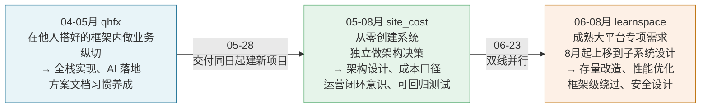

关键转折点：

- **05-28**（site_cost 第一次提交）：从「在别人建好的 RuoYi 框架上做功能」到「自己决定技术栈和架构」
- **06-09**（`6b2c4ee` 纯文档提交）：架构决策前先写 111 行方案，这个习惯此后固化
- **07-22**（`ddcacb5` 告警上线）：1400 行一次性交付，系统从「查询工具」变成「主动运营工具」，职责边界扩大
- **08-12**（权限下放，490 行设计文档）：需要反编译框架字节码才能确认实现路径，这不是写业务代码，是改框架行为
- **08-13**（权限模型重构）：**主动改自己一天前定的安全模型** —— 把配置权从超管专属改为范围内委派。收紧权限只需要判断身份，放开权限必须先把新防线（服务端逐站点范围校验）建好，是两种不同量级的判断

一个可观察的迁移：**site_cost 期养成的工作方式（先文档、显式承认缺口、留回退路径）在 8 月的 learnspace 权限子系统里被完整复用**。515 行设计文档里 5 处作废自己早期结论的记录，与 site_cost 里「策略 4 据此可挽回 252 个」这类注释是同一种习惯。

08-12 那笔跨库事务修复补上了一项此前没有直接证据的能力：**对 Spring 事务传播与动态数据源交互的机制级理解**。此前 learnspace 侧的类似判断（「异步线程不继承动态数据源上下文」）是识别出约束并规避，这次是在报错信息完全指向别处（「站点不存在」看起来是数据问题）的情况下，穿透三层定位到 `HibernateTransactionManager` 的连接绑定时机，并选了影响面最小的修法。

### 5.6 稳定的工作方法

三个项目共同表现出的四个习惯，每条都有多处代码证据：

**1. 重大改动先写方案文档再落地**

| 项目 | 文档证据 |
|---|---|
| site_cost | `6b2c4ee` 纯文档提交（+111 行方案，零代码）；`74f63f9` 同步产出《真实成本计算流程》；`812b562` 更新 README + CLAUDE.md + Runbook |
| qhfx | 16 份 `doc/开发/*.md`，每个大模块先写方案（PPT转PDF方案/智能学伴对接方案/移动端对接方案/动态化总体规划等）；方案与代码同日提交 |
| learnspace | SDK 接口必配 doc2 文档（4 提交一一对应）；权限下放 490 行设计文档含实测数据和反编译依据，先于代码存在 |

**2. 交付需求而不是交付提交**

- 答疑改造：主需求 1 次提交，衍生 bug 追修 4 次连续 5 天
- 知识图谱：异步化当天补分批写入 + 幂等 MERGE，同天补前端进度体验
- SDK 接口：每批接口必配单测（5 个 Test 类）+ 文档 + 升版本号发版
- site_cost 告警：阈值先统一前后端（`4bbf94c`），再改月初提醒文案（4 次迭代），每次都有实际需求驱动

**3. 在注释和文档里记录根因**

直接证据（都是他写的注释/文档，不是阅读别人的）：

- `YunyanCodeResolver.java:26`：「策略 4 据此可挽回 252 个；约 9 成未命中站点根本不在 pe_web_site 里」
- `KnowledgeServiceImpl.java` 注释：「异步线程不继承动态数据源上下文」（解释了为什么 MySQL 查询留主线程）
- `VideoStudyRecordServiceImpl.java:486` 注释：「5分钟+二倍速+5s」（解释了 605 秒上限的推导过程）
- `SiteManageServiceImpl.java:168` 注释：「原 SQL 可能以 GROUP BY/ORDER BY/LIMIT 结尾，末尾拼 AND 会语法错误」（解释了为什么外套子查询）
- `站点权限下放设计.md` 5 处作废早期结论：把每一次「我想错了，因为…」都留在文档里
- `SiteStaIngestService.java:288` 注释：「分母为 0 时不分配、不兜底摊给其他站点」（解释了口径选择的理由）
- `SitePermissionServiceImpl.java:53-75` 注释：把「切面按方法名前缀挂事务 → 事务内第一次取连接后绑定线程 → `determineCurrentLookupKey` 只在 `getConnection` 时调用 → 之后 `setDbType` 不再生效 → 校验查到 control 库的同名表 → 报站点不存在」整条因果链写完（**23 行注释解释一次改名**）
- `SitePermissionServiceImpl.java:836-838` 注释：「请求体里的 siteCodes 完全由客户端控制，只靠前端列表过滤等于没有校验」（解释了为什么服务端必须独立校验）
- `learnspace-site-permission-manage.vue:920` 及 `grid-like-table` mixin 注释：指到 `main.css:5100` 的全局裸标签规则与 `main.css:4417` 项目内既有解法（**解释了为什么必须显式覆盖，以及为什么沿用这个手法而不是另造一套**）

**4. 显式承认缺口而非掩盖**

| 缺口 | 做法 |
|---|---|
| 孤儿账单无处分摊 | 丢弃并打 info 日志，运营人员可查 |
| yunweichenben 库超时 | 降级记 0，不阻塞整个入库流程，注释写明「根治无限阻塞」 |
| 移动端 5 处保留 mock | 《移动端对接方案》第 3 节明确列出哪 5 处没有真实接口 |
| 时间窗风险 | 权限下放设计文档 `:368-370` 主动写出「站点删除后会留孤立授权记录」并评估为可接受 |
| 知识图谱未合 master | 分支 `dev_lc_knowledgegraph`，未合并；本文档附录第 3 点提醒 |
| 授权表脏数据无清理机制 | 首版设计文档归类为「可接受」并记录；**两天后在 `revokeSites` 里刻意不校验站点存在性，给这类记录留了清理入口** —— 遗留项被自己消化 |
| 弹窗表格高度不监听 resize | 注释写明「中途改窗口尺寸的场景少，不值得为它引入监听器和清理逻辑」，是权衡后的取舍而非遗漏 |

---

## 六、业务线四：LearnSpace AI 原生学习平台

> **扫描范围**：`D:\idea_project\learnspace-rest-api\learnspace-ai-study-api`、`D:\idea_project\learnspace-rest-api\learnspace-ai-study-service`、`D:\idea_project\learnspace-ai-study-web`。
> **角色定位**：核心设计者、架构负责人、全栈开发者。该节以当前工作树源码、迁移脚本、设计文档和测试用例为证据；本项目尚未按本文开头既有的 git 作者口径并入 141 次提交统计。

### 6.1 项目定位：把 AI 对话做成可推进的学习系统

LearnSpace AI Study 不是一个把聊天窗口嵌进课程页的 AI 插件，而是一套面向学生的 **AI 原生课程学习平台**。它把课程数据、学生选课关系、入课测评、知识点掌握度、学习会话、GenUI 交互、每日任务和游戏化统计放进同一条可回写链路：

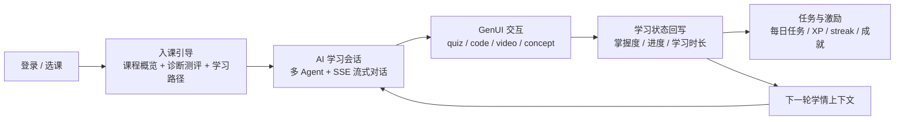

核心产品闭环是：**测评了解学生 → 生成学习画像与路径 → 围绕当前知识点对话 → 用结构化卡片让学生练习 → 将行为转换为掌握度与统计 → 重新注入下一轮提示词**。因此，AI 输出不是最终结果，而是学习状态机的一个输入。

### 6.2 三仓库边界与工程规模

物理上仍属于 LearnSpace REST API 多模块 Maven 工程，新增 AI 域的 API 与 Service 两个模块，再配套独立 Vue 前端：

| 工程 | 边界与职责 | 扫描规模 |
|---|---|---:|
| `learnspace-ai-study-api` | Spring Boot 启动、Controller、DTO、OAuth2 资源服务器、SSE 线程池、统一响应与异常 | 27 个 Java 文件，约 1,867 行；18 个 Controller；6 个配置文件 |
| `learnspace-ai-study-service` | 业务服务、实体、Mapper、Prompt/协议解析、掌握度与任务规则、MQ 抽象、数据库迁移 | 212 个 Java 文件，约 12,489 行；21 个 Mapper XML；11 个迁移脚本；4 个 Java 测试类 |
| `learnspace-ai-study-web` | Vue 3 单页应用，PC/移动端页面、Vuex 领域状态、Axios/SSE、GenUI 卡片、游戏化反馈 | 223 个 `src` 文件；105 个 Vue 文件；23 个 API service；27 个 Vuex 模块文件；13 个前端测试文件 |

后端遵循 LearnSpace 既有的 **`*-api` 接口层 + `*-service` 实现层**，Service 依赖 `learnspace-common`，并按需复用 `learnspace-video-service` 的 `CsResourceService` 解析真实视频/文档地址。API 模块通过 `@MapperScan` 同时扫描 AI、公共和视频 Mapper，启动时排除 Spring Boot 默认数据源，由 LearnSpace 的 `DynamicDataSourceRegister` 接管站点数据源。

技术栈组合：

| 层次 | 选型与作用 |
|---|---|
| 后端运行时 | Spring Boot + JDK 8；Spring MVC/Validation；Spring Security OAuth2 Resource Server |
| 数据访问 | MyBatis-Plus、MySQL、Druid、动态数据源；旧业务表只读复用，AI 状态通过扩展表/独立表承载 |
| AI 接入 | `com.whaty.learnspace.common.ai.AiModelRouter` → CBB AI 网关；模型别名可配置，默认 `qwen3.7-plus` |
| 流式与并发 | `SseEmitter` + `sseChatExecutor`，默认核心 50 / 最大 200 / 队列 200，满载 `CallerRunsPolicy` 形成背压 |
| 缓存 | LearnSpace WhatyCache/Redisson 封装；统一 `CacheService`、Key 工厂和 TTL，缓存异常降级直读数据库 |
| 异步骨架 | RocketMQ 5 客户端依赖、Topic/Consumer 抽象；默认 `mq.enabled=false`，生产者退化为日志实现，业务可同步降级 |
| 前端 | Vue 3.5 + TypeScript + Vite 8 + Vuex 4 + Vue Router 4 + Element Plus；Markdown/DOMPurify/KaTeX/Prism |

### 6.3 总体架构与端到端链路

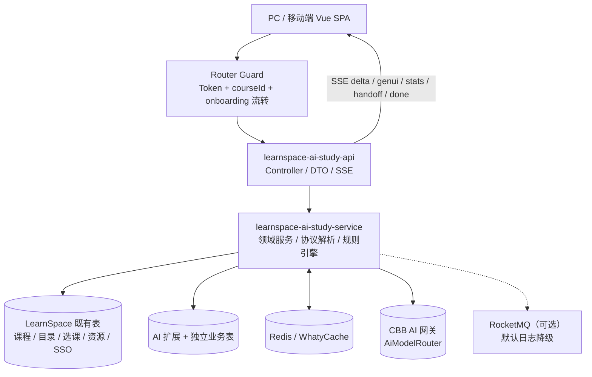

一次完整的学习请求可以还原为以下顺序：

1. **上下文建立**：前端 URL 只携带 `courseId`，token 通过 `rest_token` Cookie/本地存储取得；后端从 OAuth2 当前用户的 `suId` 反查 `sso_user_detail → pr_tch_stu_elective`，得到唯一 `enrollmentId`。
2. **课程上下文**：`GET /course-context` 一次返回课程、章节、当前知识点、完成态、总体进度/掌握度和游戏化阈值。路由守卫只负责鉴权、上下文加载和引导流转，缺少 `courseId` 或上下文加载失败交给页面友好提示，避免跳转死循环。
3. **会话准备**：`POST /sessions` 创建或恢复 active 会话，锚定 `chapterId/kpId/agentType`；进入页面加载历史消息和该会话的 GenUI 交互状态。
4. **AI 调用**：后端先完成 session 校验、用户消息落库、最近 20 条历史读取，再调用模型，避免 AI 长 IO 占用数据库连接。含图片时走识图接口；含附件时用 Apache POI 抽取 doc/docx/xls/xlsx/pptx 文本拼接到本轮消息。
5. **结构化处理**：依次解析并从正文剥离 `handoff`、`mastery`、`followup`、`genui` 四类协议；视频卡片再用真实课程资源重建，找不到匹配资源时丢弃卡片并生成兜底引导。
6. **持久化与状态推进**：保存 Agent 消息及 GenUI JSON，按 mastery 信号推进知识点掌握度，按会话时长更新统计，评估是否触发自动委派或知识点考核入口。核心消息失败抛错，统计/委派等辅助动作尽量 best-effort，不让外围故障破坏对话主链路。
7. **前端增量渲染**：SSE 由纯函数 `SseDecoder` 按空行分帧，`delta` 逐字更新，`genui`/`stats`/`handoff`/`done` 分类型提交 Vuex；流式期间和终态都清洗协议块，避免模型自评 JSON 泄漏到 UI。
8. **交互回写**：Quiz 答题、代码运行、视频进度分别调用 `/genui` 接口，记录 `genui_interaction`，写入 XP、学习时长、答题统计和 mastery，并在掌握阈值跨越时返回下一知识点/下一章推进信号。

### 6.4 后端分层与平台适配

#### API 层：稳定的学生端契约

Controller 按业务域拆分，统一返回 `{code, message, data, timestamp, requestId}`；`GlobalExceptionHandler` 只作用于 `aistudy.controller`，不会污染 LearnSpace 其他模块的响应体系。主要接口簇如下：

| 业务域 | 主要接口 |
|---|---|
| 课程与引导 | `/courses`、`/course-context`、`/onboarding/courses/{courseId}/overview`、`assessment`、`learning-path`、`onboarding` |
| 会话与 Agent | `/sessions`、`/sessions/{id}/messages`、`/agents`、`/agents/sessions/{id}/switch` |
| 对话 | `POST /chat`，`stream=false` 返回 JSON，默认 `stream=true` 返回 SSE |
| 知识图谱与掌握度 | `/knowledge-graph`、`/assessment/kp/{kpId}/quiz` |
| GenUI | `/genui/interactions`、`/genui/quiz/{id}/answer`、`/genui/code/{id}/run`、`/genui/video/{id}/progress` |
| 资源与播放器 | `/resources`、`/player/aliplayer-license` |
| 任务/统计/激励 | `/tasks`、`/stats`、`/gamification`、`/emotional-support`、`/answer-records` |

#### OAuth2、站点上下文与动态数据源

- `ResourceServerConfig` 沿用 LearnSpace JWT 公钥与 `CookieTokenExtractor`，统一从 `rest_token` 取 token；除健康检查等公开入口外，AI API 全部要求认证。
- `CourseContextService` 把登录用户、课程 ID、选课记录、AI 扩展字段和课程概览组合成一个前端上下文，避免页面各自猜测身份或重复拼装。
- AI API 启动类排除 `DataSourceAutoConfiguration`，由动态数据源注册器管理业务库；SSE 异步线程显式透传 `datasourceCode`，并在 `finally` 清理线程本地上下文，防止线程池复用时串站点。
- 选课写入复用 `TchStuElectiveService`，学生身份使用 `suId`，而选课表的 `FK_STU_ID` 仍按旧系统约定写入 `sso_user_detail.ID`，由 Mapper 做身份转换。

#### 缓存、降级与并发边界

`CacheService` 统一封装读、写、删除和 `getOrLoad` 读穿透，课程概览、学习路径、知识点依赖、资源列表、今日统计/任务等均有集中 TTL。任何缓存异常只记录日志并回退数据库，缓存不是主流程单点。

`SseExecutorConfig` 的专用线程池承接模型 IO，Tomcat 请求线程在返回 `SseEmitter` 后释放；队列与线程均耗尽时 `CallerRunsPolicy` 让提交线程执行，形成背压而不是静默丢请求。SSE 侧监听完成、超时、错误并设置取消标志，客户端断连时停止继续推送。

### 6.5 AI 工程：Prompt、协议与多 Agent 编排

#### Prompt 是可演进配置，不是散落字符串

`prompts/ai-chat-prompts.yaml` 分为角色人格、工具增强、GenUI 输出规范、handoff 自评、mastery 自评、followup、考核出题和问候语生成等段落；`PromptTemplateService` 用 SnakeYAML 解析，内存缓存按配置 TTL 重新加载。Java 负责注入真实学情，YAML 负责规定表达风格和结构协议，形成“数据与表达解耦”。

三种 Agent 不是三个学科模型，而是三种教学职责：`tutor` 负责深度讲解，`buddy` 负责情绪陪伴与轻松探索，`examiner` 负责出题、批改与追问薄弱点。会话系统记录 `agent_type`，历史消息保留自身 `agent_name`，切换后旧消息头像和人格不被当前 Agent 覆盖。

#### 四类结构化协议把自然语言接入业务状态机

| 协议 | 模型输出 | 后端动作 | 前端表现 |
|---|---|---|---|
| `genui` | `uiType + config` | 解析并持久化 `genui_data`；视频配置用真实资源重建 | Quiz/Code/Video/Concept 卡片 |
| `mastery` | 学习相关、熟练度、是否讲全 | `MasteryService.applyLearning`，决定掌握度增益和考核入口 | 掌握度、下一步 CTA |
| `followup` | 下一轮快捷问题数组 | 与视频兜底、后端业务引导合并去重限流 | 消息下方快捷回复 |
| `handoff` | 本轮职责匹配度和推荐 Agent | 会话维护连续不匹配计数与冷却期，触发时只下发信号 | 插入过渡提示，复用已有切换链路 |

协议解析器均有容错：缺块、非法 JSON、非法 Agent 或过长选项会回到安全默认值；正文与协议块分离，前端 `cleanAgentContent` 对流式中间态和终态各清洗一次，兼容协议块跨 SSE 分片的情况。

#### 自动委派的职责边界

`HandoffEvaluator` 默认以匹配度 `< 0.5` 作为非本领域，连续 3 轮才触发委派，中间命中一次即清零；触发后进入 5 轮冷却，避免 tutor/buddy/examiner 之间乒乓切换。后端**不直接改 `session.agent_type`**，只在 `handoff` SSE 事件里给出 `target_agent` 和友好文案，前端 `learning/switchAgent` 复用 350ms 防抖、AbortController 取消旧请求、乐观插入委派/打招呼消息的成熟链路。这是对双写和重复消息风险的主动收敛。

#### SSE 流式链路的可用性处理

`ChatController` 设置 `X-Accel-Buffering: no` 和 `Cache-Control: no-cache`，避免代理把 token 攒成整段；后端把 `delta`、`genui`、`stats`、`handoff`、`done` 分成事件，前端用 `fetch + ReadableStream` 而不是 Axios 读取流。非流式 fallback 用统一 API 返回后，前端以伪打字机恢复“正文先到、卡片/统计后到”的感知顺序。

### 6.6 学习数据模型：兼容存量而非另起炉灶

数据设计的核心判断是：课程、目录、选课、资源、SSO 都已有稳定业务主表，AI 不应复制一套课程树再靠同步维持一致性。`AI-STUDY-数据表清单.md` 明确记录了“复用旧表 + AI 扩展 + AI 独立业务表”的策略：

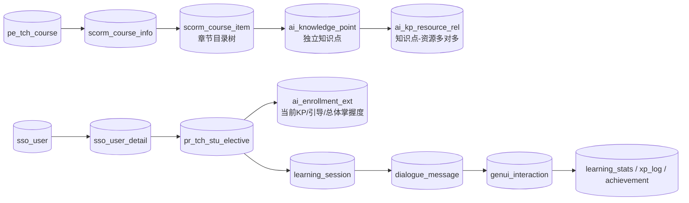

数据层分成四组：

1. **只读复用的 7 张既有表**：课程 `pe_tch_course`、目录 `scorm_course_item`/`scorm_course_info`、选课 `pr_tch_stu_elective`、资源 `cs_resource`、身份 `sso_user`/`sso_user_detail`。
2. **3 张扩展表**：`ai_kp_ext`（章节标记、难度、时长、前置关系）、`ai_enrollment_ext`（当前知识点、引导完成、总体掌握度）、`ai_resource_ext`（资源分级、访问热度、章节排序）。
3. **知识点独立化的 2 张表**：V104 新建 `ai_knowledge_point` 与 `ai_kp_resource_rel`。知识点从原来与 SCORM 节点 1:1 死绑，改为独立 UUID 实体；同一资源可被多个知识点引用，`legacy_item_id` 保留迁移溯源并以唯一键保证幂等。
4. **15 张 AI 独立业务表**：学生画像、XP/成就、单知识点掌握度、会话/消息/GenUI、每日任务/日统计、题库/答题记录、入课测评、金句与洞察模板等。旧版 `student/course/chapter/knowledge_point/course_enrollment/course_resource` 遗留表在 V100 中废弃，不再维护两套主数据。

所有 AI 独立表使用字符串 UUID，跨旧表的关联列按现网 `VARCHAR(50)` 对齐；迁移脚本去除物理外键，依靠 Mapper/Service 校验和索引维护一致性。V105/V109 支持从 SCORM 树按课程迁移知识点和资源关系，可重复执行、不产生重复行。

### 6.7 关键业务规则与学习状态闭环

#### 入课测评与路径生成

`OnboardingServiceImpl` 的题库解析顺序是“课程专属题组 → 通用题组 → 内置常量题兜底”，提交时严格按实际题组校验答案数量和选项值域，并以 enrollment 所属学生做越权校验。`LearningProfileBuilder` 将答案归一为五个维度（先验知识、时间预算、学习风格、目标取向、难度偏好），计算预计学时、教学风格、难度曲线和维度快照；`StrategyRuleEngine` 通过 Spring 注入的 `DimensionEvaluator` 列表按优先级产出策略文案，新增维度无需改引擎。

引导完成具备幂等性：重复完成不会重复覆盖当前知识点；首次完成会定位首章首个知识点，并尝试生成今日任务。MQ 可用时发 `TASK_GENERATION`，默认不可用则同步调用 `DailyTaskService`，保证开发环境和无 MQ 环境仍可用。

#### 知识图谱与知识点推进

`KnowledgeGraphServiceImpl` 用前置依赖 JSON 构建“前置节点 / 当前节点 / 后继节点 / 固定长度链”视图，依掌握度 70% 判定 `done`；切换当前知识点时校验所有前置知识点是否达到阈值，并同步更新进行中会话的 `kp_id`，避免右栏进度与对话锚点割裂。依赖链按 `kpId + studentId` 缓存 10 分钟。

#### 掌握度是单一数据源（SSOT）

`MasteryServiceImpl` 把答题、视频、代码、阅读、对话统一归一为一次增量：

```text
gain = round(BASE_GAIN × 行为权重 × 难度系数 × AI质量系数 × 衰减系数)
```

- 答对/答错走答题路径并计入 `quiz_total/quiz_correct`，答题掌握度允许推进到 100%。
- 视频、代码、阅读、聊天等非答题行为最多推进到 60%，剩余掌握度必须由答题贡献，避免“只聊天就满分”。
- AI `proficiency` 映射到 0.5~1.5 质量系数；越接近上限，衰减系数越小，推进趋于收敛。
- 每次 upsert 后重新计算 enrollment 下已学知识点平均值，写回 `ai_enrollment_ext.overall_mastery`。

`GenuiServiceImpl` 是行为回写枢纽：Quiz 答题事务内同时写交互、XP、掌握度、答题统计，并评估知识点/章节推进；Code 运行增加学习时长并推进少量 mastery；Video 完成按真实进度增加 XP/时长、幂等完成 watch_video 任务并推进 mastery。

#### 每日任务、XP 与资源热度

每日任务不是随机三条文案，而是规则规划：当前知识点掌握良好时安排下一知识点视频，否则安排当前知识点视频；选择 enrollment 下未达 70% 的最弱知识点出题；按总体掌握度选择基础/常规/进阶阅读。XP 由 `XpRules` 统一定义，`xp_log` 记录来源，成就接口用数据库幂等判断首次里程碑。

资源访问采用 5 分钟时间窗去重，优先 Redis，失败降级进程内 `ConcurrentHashMap`；MQ 可用时异步累加 `access_count`，不可用时直接更新。这一设计把“资源热度统计”与“打开资源主流程”解耦，并明确承认 Redis/MQ 不可用时的弱一致边界。

### 6.8 前端架构：同一套领域状态覆盖 PC 与移动端

前端不是页面堆叠，而是按通信、状态、组件、视图四层组织：

```mermaid
flowchart TB
    view["Views / Components\nCourseLearn + MobileLearn + onboarding + overview"]
    store["Vuex namespaced modules\nlearning / course / onboarding / genui / progress / ui ..."]
    api["API service\nrequest/http + chat/SSE + domain services"]
    backend["AI Study API"]
    view --> store --> api --> backend
    backend -->|统一响应| api
    api -->|类型化数据 / SSE 事件| store
    store --> view
```

#### 通信层与安全边界

`api/http.ts` 注入 Bearer token，统一解包 `{code,message,data}`，对 20001/20003 清理 token 并去重提示；AbortController 取消被转换为错误码 -1，调用方静默忽略。普通接口走 Axios 的 `request.ts` 类型化封装，SSE 走 `fetch`，由 `SseDecoder` 处理任意切分的 UTF-8 文本、空行分帧、`[DONE]` 和残留 flush。

#### Router Guard 与动态上下文

`routes.ts` 同时维护 PC 与 `/m` 移动端路径，`guards.ts` 只做三件事：公开页放行、无 token 跳对应端登录、带 `courseId` 时幂等加载 `course/fetchContext` 并按 onboarding 完成态重定向。移动端路径表由 `pathsFor()` 统一选择，保证移动端不会被错误打回 PC 页面；缺课程参数不在守卫层硬拦截，由目标页面渲染 `MissingCourseView`。

#### Vuex 领域状态与对话编排

- `learning` 管理 session、Agent、消息、流式状态、思考过程、统计快照、历史会话和断线续聊；从历史消息恢复 GenUI/followup，查看历史会话时保持右栏学生当前真实进度不被历史会话误导。
- `genui` 以 `messageId` 为 key 记录答题/运行/观看状态，刷新时调用 `/sessions/{id}/genui` 恢复交互；卡片分发器将 `quiz/code/video/concept` 映射到独立组件。
- `course` 管理课程上下文、当前章节/知识点、引导完成态和后端下发的游戏化阈值；`knowledgeGraph`、`courseResources`、`progress`、`task`、`emotional`、`video` 分域维护学习页右栏与工具箱数据。
- `ui` 是统一游戏化编排器：庆祝事件串行队列、里程碑 key 去重、streak 告急、XP 飞入，以及 `prefers-reduced-motion` 下的静态降级，避免多个组件各自播放造成重叠。

PC `CourseLearn.vue` 与移动端 `MobileLearnView.vue` 复用同一套 store/API/领域类型，只替换布局外壳和交互方式；PC 侧是侧栏 + 主对话 + 右栏，移动端是状态区 + 对话列表 + 底部工具/历史抽屉，形成“一套业务状态、两套响应式体验”。

### 6.9 质量保障、工程判断与贡献证据

可见测试不是只测组件快照，而是覆盖跨层契约和容易回归的状态边界：

| 领域 | 测试证据 |
|---|---|
| 后端协议 | `FollowupParserTest`、`MasteryParserTest`、`HandoffEvaluatorTest` 覆盖缺块/非法 JSON/连续触发/冷却/清零 |
| 后端规则 | `MasteryServiceImplTest` 覆盖难度系数、答题/非答题上限、70% 跨阈值、考核一次置满 |
| 前端通信 | `src/utils/__tests__/agentText.spec.ts` 覆盖协议块跨分片清洗、真实代码块不误删；路由守卫测试覆盖 PC/移动端重定向与缺参容错 |
| 前端交互 | GenUI 卡片测试覆盖四类分发、答题正误、代码转义；统计组件/反馈组件测试覆盖进度、streak、庆祝状态 |

从源码形态可以确认的核心贡献不是“做了若干页面”，而是建立了一套可持续演进的 AI 学习底座：

1. **架构设计**：在既有 LearnSpace 多模块、动态数据源和旧表体系中落下独立 AI 域，采用 API/Service 分离、扩展表与独立知识点表，避免复制课程主数据。
2. **AI 工程化**：设计 Prompt 配置协议、四类结构化输出解析、模型路由、SSE 事件模型、GenUI 真实资源重建和自动委派状态机，让模型能力可被程序校验和持久化。
3. **学习科学规则落地**：把测评画像、前置依赖、掌握度增益、非答题上限、章节推进、每日任务和 XP 里程碑统一成可测试规则，而非散落在页面事件中。
4. **可靠性与降级**：数据库 IO 与 AI IO 解耦，SSE 有专用线程池和取消标志，缓存/MQ/视频资源均有明确 fallback；辅助统计失败不阻塞核心对话。
5. **全栈闭环交付**：前端 API/SSE、Vuex 领域状态、PC/移动端双壳、GenUI 卡片、历史恢复、自动委派和游戏化反馈与后端契约同步演进。
6. **边界意识**：当前 MQ 默认是日志降级实现，代码卡片的 `/run` 是业务接口能力，源码没有证明存在隔离沙箱；知识图谱后继跨章补足仍留有 TODO；V109 虽声明用 `@course_id` 驱动单课程转换，实际 SQL 条件仍写死一门课程 ID，上线复用前应改为变量。把已实现、可降级和待完善边界写清楚，比把设计意图误写成生产能力更准确。

### 6.10 关键文件索引

```text
后端启动与安全
learnspace-ai-study-api/src/main/java/com/whaty/learnspace/LearnspaceAiStudyApiApplication.java
learnspace-ai-study-api/src/main/java/com/whaty/learnspace/config/ResourceServerConfig.java
learnspace-ai-study-api/src/main/java/com/whaty/learnspace/config/SseExecutorConfig.java
learnspace-ai-study-api/src/main/java/com/whaty/learnspace/aistudy/common/GlobalExceptionHandler.java

AI 对话与协议
learnspace-ai-study-service/src/main/java/com/whaty/learnspace/aistudy/service/impl/ChatServiceImpl.java
learnspace-ai-study-service/src/main/java/com/whaty/learnspace/aistudy/common/prompt/PromptTemplateService.java
learnspace-ai-study-service/src/main/java/com/whaty/learnspace/aistudy/common/prompt/LearningContextBuilder.java
learnspace-ai-study-service/src/main/java/com/whaty/learnspace/aistudy/common/handoff/HandoffEvaluator.java
learnspace-ai-study-service/src/main/java/com/whaty/learnspace/aistudy/common/mastery/MasteryParser.java
learnspace-ai-study-service/src/main/java/com/whaty/learnspace/aistudy/common/genui/GenUiParser.java
learnspace-ai-study-service/docs/Agent自动委派切换方案.md

学习状态与数据
learnspace-ai-study-service/src/main/java/com/whaty/learnspace/aistudy/service/impl/OnboardingServiceImpl.java
learnspace-ai-study-service/src/main/java/com/whaty/learnspace/aistudy/service/impl/MasteryServiceImpl.java
learnspace-ai-study-service/src/main/java/com/whaty/learnspace/aistudy/service/impl/GenuiServiceImpl.java
learnspace-ai-study-service/src/main/java/com/whaty/learnspace/aistudy/service/impl/KnowledgeGraphServiceImpl.java
learnspace-ai-study-service/src/main/resources/db/migration/AI-STUDY-数据表清单.md
learnspace-ai-study-service/src/main/resources/db/migration/V100__ai_study_uuid_tables.sql
learnspace-ai-study-service/src/main/resources/db/migration/V104__ai_knowledge_point_tables.sql

前端
learnspace-ai-study-web/src/router/guards.ts
learnspace-ai-study-web/src/api/chat.ts
learnspace-ai-study-web/src/api/sse.ts
learnspace-ai-study-web/src/store/modules/learning.ts
learnspace-ai-study-web/src/store/modules/genui-actions.ts
learnspace-ai-study-web/src/store/modules/ui-actions.ts
learnspace-ai-study-web/src/views/CourseLearn.vue
learnspace-ai-study-web/src/views/mobile/MobileLearnView.vue
learnspace-ai-study-web/README.md
```

---

## 七、附录

### 7.1 提交清单速查

**site_cost（45）** — 关键提交
| commit | 日期 | 主题 |
|---|---|---|
| `221fc1a` | 05-28 | 站点学习时长、流量显示（**仓库首个功能提交**） |
| `76a41b4` | 06-03 | 新增站点统计查询功能并重构数据格式化逻辑 |
| `7f77131` | 06-04 | 重构站点统计查询功能并优化前端界面 |
| `605588c` `3333d3b` | 06-05 | 查询性能优化 + 并发化与窄查询 |
| `6b2c4ee` | 06-09 | 更新数据库预存方案（**纯文档**） |
| `c80f77f` | 06-09 | 站点来源改用数据库表，新增部门筛选 |
| `482ed69` | 06-10 | **查询接入本地预存储 + 汇总卡片 + 定时入库（架构转型）** |
| `039cebf` | 06-11 | 增加 jenkins 部署脚本、README |
| `8df2c9f` | 06-15 | 新增真实费用按天预存储，流量单价可配置 |
| `d7fa072` | 06-17 | 增加 oss-login 验证统一用户中心 |
| `74f63f9` | 06-17 | **真实费用分摊口径修正 + 云眼 code 解析统一 + BigDecimal** |
| `983d9bc` | 07-10 | 钉钉机器人 |
| `ddcacb5` | 07-22 | 部门管理页 + 钉钉提醒定时任务（约 1400 行） |
| `4bbf94c` | 07-27 | 优化站点 CDN 状态判定与多周期告警 |
| `812b562` | 07-27 | **接入产品站点同步流水线并统一业务线来源（约 1200 行）** |
| `85d5458` ~ `bf71c59` | 07-30 ~ 08-04 | 月初提醒四次迭代 |

**qhfx（49）** — 关键提交
| commit(api / web) | 日期 | 主题 |
|---|---|---|
| `9399321` / `28980b6` | 04-10/13 | 对接智能备课后端接口（word 导出 + AI 助手未实现） |
| `741d597` | 04-13 | 对接备课助手后端接口，**AI 助手（CbbAiClient 429 行）** |
| `a102e30` | 04-16 | **确定业务代码在 ruoyi-system 内开发（181 文件重构）** |
| `bb9f10d` | 04-16 | 新增动态化整体规划（353 行） |
| `8ca2491` / `eb4d690` | 04-20 | 学生表设计方案（888 行 SQL）+ 学生管理 |
| `37cf970` / `c7934a1` | 04-23 | 新增年级、班级、学期、教师管理（46 文件 1701 行） |
| `8971333` / `38e6051` | 04-24 | 课程绑定班级，课程添加成员，智能体 AI 对接 |
| `a87a7d2` / `92161b4` | 04-27 | 修改课程管理逻辑，对接课堂助手 AI |
| `e138233` / `c5d81a9` | 04-28 | **实现流程：布置作业-智能批改-查看批改** |
| `7aa2877` / `82caf79` | 04-29 | 智能学伴模块（25 文件 1188 行 + 324 行方案） |
| `d6a46ed` / `3ed1827` | 05-09 | 备课文档多 PPT 管理及 PPT 转 PDF 预览 |
| `b9b6ba6` `1fc28c0` | 05-12 | 两次修 PPT 翻页滚动定位偏移 |
| `e5e87e7` / `6837f65` | 05-15 | **AI 批改步骤级批注（细粒度拆分 + 原文高亮定位）** |
| `9882866` / `ee12ab0` | 05-22 | 批改结果持久化（评分维度、步骤批注、批注明细） |
| `d480dbc` / `6c75180` | 05-18 | eduRole 教育角色字段 + 移动端登录与角色路由 |
| — / `ae05a22` | 05-25 | 移动端学生/教师页面接入后端 API，移除 mock |
| `a0fb89e` / `24c3f15` | 05-28 | 学生端作业列表/提交/批改查询 + 学伴/课堂/班级报告/直播 |
| `eae8e0f` | 05-28 | 移动端对接方案文档（225 行）+ 表结构修复脚本 |

**learnspace（45）** — 见 §4.7 时间线

### 7.2 关键文件索引

**site_cost**（`D:\idea_project\site_cost`）
```
service/SiteStaQueryService.java          974 行  查询中枢，local/remote 双路径、缓存、导出
        :104-114  ConcurrentHashMap 结果缓存，TTL 10 分钟，双 key(全量 / 全量~关键字)
        :117-124  跨库并发查询线程池(固定 4 线程，守护线程，注释说明为何是 4)
        :161-168  CachedResult 缓存条目(数据行 + 未匹配行 + 原始指标 + 过期时间)
        clearCache() 7 处调用：定时入库后、流水线后、3 个回填接口后、设手工部门后
job/IngestLock.java                       入库互斥锁（**lizhuang 08-10 新增，非李超**）
        :29-32    为什么用 tryLock 而非 lock（幂等全量重算，排队无意义）
        :34-36    单实例前提，扩多实例需换 shedlock 或数据库行锁
service/SiteStaIngestService.java         774 行  :287-304 bxqk 按天分摊；:442-593 真实费用有效单价法
service/SiteCostAlertService.java         393 行  :35/:38 阈值；:144-174 月初提醒
service/SiteStaPipelineService.java        71 行  :40-70 四步串行流水线
utils/YunyanCodeResolver.java             159 行  :49-120 五策略解析 + 存在性校验
utils/DingTalkNotifier.java               123 行  :108-123 加签；:83-93 @ 高亮
service/pps/ProductSiteSyncService.java           :41-70 防重入防空；:333-335 大小写修复
service/pps/ProductDepartmentService.java         :29-71 课程空间到部门推导
resources/db/schema_prestorage.sql                :19-32 site_dim；:57-83 事实表分区
resources/mapper/SitePrestorageMapper.xml         :128 有效部门 COALESCE
job/SiteStaIngestJob.java                         :42  每日 05:00 流水线
job/SiteCostAlertJob.java                         :29  每日 09:30；:43 每月 3 日 09:40
controller/SsoLoginController.java                :40-95 OAuth2；:71-78 state 防 CSRF
static/js/index.js                        755 行  :149-161 前端状态分档（与后端对齐）
README.md                                 278 行  理解此系统最好的入口
doc/真实成本计算流程.md                            真实费用口径权威文档
doc/站点统计查询部署运维Runbook.md
```

**qhfx-api**（`D:\qhfx\dev_lvzw_keep3\qhfx-api`）
```
ruoyi-common/ruoyi-common-core/.../utils/ai/CbbAiClient.java        429 行 AI 底座
ruoyi-common/.../config/ai/CbbAiProperties.java                     :10  cbb.ai 配置
ruoyi-system/.../service/education/impl/AiGradingService.java       320 行 :183-218 prompt 工程
ruoyi-system/.../service/education/impl/GradeResultServiceImpl.java :37 保存；:104 查询
ruoyi-system/.../domain/vo/AiGradingResultVo.java                   items/annotations/steps
ruoyi-system/.../domain/education/GradeResult.java                  三个 JSON 列
ruoyi-system/.../controller/education/EduHomeworkSubmitController.java :68,75,81,87
ruoyi-system/.../controller/lessonprep/AiLessonDocController.java   :63,159,182,213,244
ruoyi-system/.../util/PptToPdfConverter.java                        :23-57 LibreOffice 调用
ruoyi-system/.../controller/companion/*.java                        学伴四 controller
ruoyi-system/.../service/education/impl/EduHomeworkServiceImpl.java :56-87 学生作业列表
ruoyi-system/.../controller/education/TeacherDashboardController.java :45 看板
script/sql/education/grade_init.sql                                 批改两表 DDL
doc/开发/移动端-对接方案.md                                          225 行作战计划
doc/开发/动态化总体规划.md                                           353 行
```

**qhfx-web**（`D:\qhfx\dev_lvzw_keep3\qhfx-web`）
```
src/views/qhfx/teacher/analysis/grading/index.vue         1792 行 :679 高亮；:695 联动
src/views/qhfx/teacher/lessonPrep/assistant/components/DocEditor.vue    1763 行
src/views/qhfx/teacher/lessonPrep/assistant/components/AiChatPanel.vue   979 行
src/views/qhfx/teacher/classroom/presentation/components/SmartClass.vue 2524 行 :613,:881 翻页
src/views/qhfx/teacher/classroom/assistant/index.vue       336 行 :83 两阶段状态机
src/views/qhfx/student/classroom/homework/index.vue        528 行 学生端批改详情
src/permission.ts                                          :34,:43,:126 移动端路由守卫
src/router/mobile/{index,student,teacher}.ts               35 页路由
src/api/qhfx/homeworkSubmit.ts                             :53 aiGrade 超时 120s
```

**learnspace**（`D:\idea_project\learnspace-*`、`discuss-web`）
```
rest-api/learnspace-common/.../util/LearnSettingEnum.java           :288 配置枚举
rest-api/learnspace-discuss-service/.../impl/CommonServiceImpl.java :140,:191-194 配置读取
rest-api/learnspace-discuss-service/.../mapper/DiscussCommentMapper.xml
                                            :385 线程分页；:425 子评论；:492/:665 数量修复
rest-api/learnspace-open-api/.../controller/LearnspaceSdkController.java  :1482-1522
rest-api/learnspace-open-api/.../controller/LearnRecordSdkController.java :52-62
rest-api/learnspace-open-api/.../controller/SdkBaseController.java        :26-40 siteCode 鉴权
rest-api/learnspace-open-api/.../impl/CourseManageServiceImpl.java :4277,:4340,:4346
        :2405-2411 课程发布清缓存：CacheUtil + LearnspaceCacheUtil 两套(key = courseId+"_info")
        6 月 batchUpdateCourseTemplate 同模式，一次最多清 6 个 key
        (getSiteSettingConfigCacheKey / getSettingsCacheKey /
         getCourseHeightSettingCacheKey / getCourseHeightConfigForTypeCacheKey)
rest-api/learnspace-common/src/main/resources/mapper/LearnRecordMapper.xml :28 FORCE INDEX
rest-api/learnspace-common/src/main/resources/mapper/TchStuElectiveMapper.xml :359 LEFT JOIN
rest-api/learnspace-learning-service/.../graph/impl/KnowledgeServiceImpl.java
        :120-139  Redis 状态机：查 running 则拒、置 running、投异步线程池
        :152-171  异步体内改 success / failed，两处都带 TTL
        :177-184  状态查询；查不到返回 success(避免历史数据卡住)
rest-api/learnspace-learning-service/.../util/KnowledgeConstants.java
        :60-86    GRAPH_BATCH_SIZE=50
        ONE_CLICK_GENERATE_STATUS_CACHE_KEY = "oneClickGenerateStatus::"
        ONE_CLICK_GENERATE_STATUS_EXPIRE = 30 * 60（TTL 兜底）
        GENERATE_STATUS_RUNNING / SUCCESS / FAILED 三态
        getOneClickGenerateStatusCacheKey(siteCode, courseId)  多站点隔离
rest-api/learnspace-learning-service/.../graph/repositories/KnowledgeRepository.java :42-43 MERGE
rest-api/learnspace-video-service/.../impl/VideoStudyRecordServiceImpl.java :486-492 时长上限
rest-api/learnspace-sdk-client/.../client/LearnspaceService.java    :1469-1497
admin-api/.../control/enums/LearnSettingTypeEnum.java               :493,:540,~:659
admin-api/.../site/service/impl/ModuleSettingServiceImpl.java       :1337 配置补全
discuss-web/src/views/index/CommentList.vue                         :152 角标；:327/:791 层级
discuss-web/src/views/list/components/replyForm.vue                 :227 自动公开判定
xxl-job-executor/.../jobhandler/LearnspaceXxlJob.java               :399-409 job 注册
doc2/docs/sdk/README.md                                             :5791 学习轨迹文档
```

**learnspace 站点访问授权**（08-12 ~ 08-13，`learnspace-admin-api` / `learnspace-admin-web`）

行号为 08-13 重构后的最新状态。

```
【后端 · 权限子系统 com.whaty.learnspace.permission】
permission/constant/SitePermissionConstant.java        57 行
        :16       超管 roleType 9999
        :26       site_code 白名单正则
        :38-47    站点分页默认10/上限50；角色人员列表默认10/上限100(按现网6角色33人员定)
        :50-56    TARGET_TYPE_ROLE / TARGET_TYPE_USER
permission/controller/SitePermissionController.java   153 行
        :20-23    类注释：接口对所有登录用户开放，越界校验在 Service 层
        :38-52    /roleList  角色分页(角色名 + 角色类型搜索)
        :56-68    /userList  人员分页(账号或姓名 + 所属角色搜索)
        :74-93    /targetSites  弹窗站点分页，managed 切已管理/未管理，四条件搜索
        :98-110   /grantSites   增量授权，返回实际新增条数
        :115-127  /revokeSites  增量撤销，返回实际撤销条数
        :132-137  /dictionaries 站点类型 + 角色类型字典
permission/service/SitePermissionService.java         181 行  11 方法接口定义（全带 Javadoc）
        :15-18    类注释：授权配置的权限模型（范围内委派 + 请求体不可信）
        :77-92    方法名不能用 save/add/update/del/remove/do 前缀（跨库事务约束，23 行注释）
permission/service/impl/SitePermissionServiceImpl.java 1092 行
        :53-75    writeTxTemplate 注释：切面→连接绑定→setDbType 失效 的完整因果链
        :85-93    延迟构造 TransactionTemplate（字段注入所以不能在构造器建；单例竞态无副作用）
        :100-113  isSuperAdmin 三重 null fail-closed
        :120-141  getAuthorizedSiteCodes 双维度并集
        :143-164  queryScopeSiteCodes  control 库 UNION 查询（角色 ∪ 人员）
        :180-213  filterValidSiteCodes  manage 库有效性交集
        :231-241  checkSitePermissionBySiteId  反查真实 code（不信任请求体）
        :289-305  buildSiteCodeSqlCondition  空集返回 1=0 + 注入白名单
        :312-357  listRoles / :359-411 listUsers  角色与人员分页
        :425-459  listDictionaries  站点类型取枚举、角色类型取数据库实际值
        :462-484  listTargetSites  已管理不收窄 / 未管理收窄到操作者范围（理由写在注释）
        :486-522  listManagedSites  Java 内存分页(为了列出孤立 code 供撤销)
        :524-568  listUnmanagedSites  SQL 分页；operatorScope 空集直接返回空页(fail-closed)
        :570-599  appendSiteFilters  四条件命名参数拼接
        :653-688  toSiteItem / toMissingSiteItem  站点已删除仍列出(exists 字段)
        :731-777  grantSites  增量授权 + 越界校验 + 已授权跳过 + 先切库再开事务
        :779-831  revokeSites 增量撤销；不校验站点存在性(为清理脏授权)；超管跳过范围校验
        :833-857  checkWithinOperatorScope  唯一的权限提升防线，任一越界整批拒绝
        :859-891  checkGrantableTarget  目标存在且非超管
        :893-941  parseAndValidateSiteCodes / parseSiteCodes  数组/逗号串兼容 + 整批拒绝
        :959-1030 pagedQuery / pageInMemory / emptyPage / toSafeCodes  分页基础设施
        :1040-1060 inManageDataSource / inControlDataSource 数据源切换与现场恢复

【后端 · 改造既有代码】
framework/config/aop/DataSourceCutAop.java                    :47-48 pointcut 纳入新包
framework/config/aop/LearnspaceManageDataSourceCutAop.java     :42   冲突来源(control.service → manage)
control/service/impl/SiteManageServiceImpl.java
        :126-160  applySitePermissionScope  深拷贝 GridConfig + 条件注入
        :168-174  appendWhere  子查询外套(避免 GROUP BY/ORDER BY 结尾语法错误、OR 优先级绕过)
        :183-192  appendConditionToCountSql  WHERE 后插入(不能外套，否则总数永远为 1)
        :294-300 / :323-330 / :337-341  update / updateColumn / delete Service 层兜底
control/controller/SiteManageController.java                   6 处校验接入
control/util/LearnspaceUtils.java                              新增 getCurrentUser()

【数据库与文档】
docs/database/control站点权限.sql          97 行  :23-51  pr_role_site_scope / pr_user_site_scope
                                               :72-77  校验未建跨库外键应返回 0 行
docs/database/control站点权限菜单配置.sql 307 行  （08-12 大改：菜单位置 + 接口注册）
                                               菜单改挂「课程空间管理」二级菜单(show_in_left_menu='1')
                                               理由：站点管理下 6 个子节点入口是 Grid 行级按钮、会带 siteCode，
                                                     而权限配置是全局页不属于某个站点
                                               url 取空串而非 NULL(permission.js:27 会调 url.indexOf)
                                               新增 pe_interface + pr_base_category_interface 注册
                                                     否则菜单可见但接口一律 403
                                               菜单名「站点权限管理」→「站点访问授权」
                                               含上线前核对(只读) / 正式配置 / 配置后校验 / 回滚 四段
docs/database/control新增项目经理账号.sql 109 行  测试用项目经理账号(wt_test_xmjl, roleType 9998)
                                               讲清框架登录机制：无盐单次 MD5 32 位小写 hex
                                                     (md5sum 与 MySQL MD5() 交叉验证)
                                               site_code 必须 'control'(登录 SQL 带该条件 + 唯一键)
                                               FLAG_ISVALID/FLAG_BAK 留 NULL(有 enum_const 外键)
                                               密码满足 Constant.userPasswordPattern 以免改密被卡
                                               含事务 + NOT EXISTS 防重 + 3 条校验 + 回滚
docs/站点权限下放设计.md                 515 行 :36-44  本期不包含清单
                                               菜单位置调整的理由(全局配置页 vs 站点行级按钮)
                                               框架 URL 鉴权链路：/control/** 落 denyAll，
                                                     唯一放行是 UrlMatchVoter 取 pe_interface.url，
                                                     故新接口必须注册（修正首版"不依赖菜单 URL 权限"表述）
                                               :56-80  现网结构与两个 pe_web_site 的坑
                                               :92-104 作废早期"角色跨站点授权语义矛盾"结论
                                               :121-127 双维度设计理由
                                               :176-224 为什么必须拼接 SQL（反编译依据）
                                               :254-267 异常类型选择论证
                                               :345-352 配置侧越权防护
                                               :368-370 跨库时间窗风险评估
                                               :405-430 前端 7 个保持原状文件清单
                                               :461-490 发布顺序与 8 步验证清单

【前端】
src/custom/components/learnspace/learnspace-site-permission-manage.vue  995 行
        （08-13 重写：el-select 远程多选 + 一次保存 → 主列表分页 + 弹窗双表穿梭）
        :59-83        角色 Tab 表格，操作列置首列、宽 110("无需配置"在 100px 下会被截断)
        :152-180      人员 Tab 表格，列序同上
        :197-205      弹窗 width 90% + top 5vh
        :286-300      未管理站点表(勾选 + 四条件搜索 + 分页)
        :328-345      已管理站点表(含已删除站点标注)
        :445-455      siteTableHeight 按视口推算，夹 [300,620]，只在打开弹窗时算一次
        :516-525      统一响应处理，errCode 非 0 提示并按失败处理
        :550-556      人员 Tab 懒加载(用独立标志位而非列表长度判空)
        :583          搜索条件变化强制回第 1 页
        :662          打开弹窗先清残留，避免闪现上一个对象数据
        :712          列表刷新后清勾选态
        :840-905      grantSites / revokeSites 调用与二次确认
        :907          授权变化后回第 1 页(条数变了当前页可能越界)
        :920-960      grid-like-table mixin：显式覆盖 main.css:5100 全局 th/td 规则
                      列间距加在 .cell 而非 th/td(避免与 el-table 列宽计算冲突)
                      勾选框列保持居中
        组件 name 须与 pe_base_category.code 一致
src/custom/components/custom-components-register.js            :26,:42 组件注册
```

### 7.3 技术提醒与待办

分析过程中发现以下几处值得处理（均不影响现有功能）：

1. **site_cost 的 `application.yml` 硬编码了生产环境凭证** —— SSO client-secret（:163）与钉钉机器人 webhook access_token（:154）。webhook 虽写了 `${DING_WEBHOOK:...}` 支持环境变量覆盖，但默认值就是真 token；而 README:169 明确要求「不要写死进仓库」，文档与配置实际状态不一致。建议清掉默认值改为纯环境变量注入。
2. **site_cost 存在 JDK 版本假设不一致** —— pom 声明 `java.version=17` 且李超代码用了 switch 表达式，但 lizhuang 有一笔提交「将 switch 表达式改为传统 switch 语法**兼容 JDK 8 编译环境**」。说明两人构建环境不一致，或 CI 上存在 JDK 8 编译环节，是潜在构建隐患。
3. **learnspace 知识图谱异步化尚未合入 master**（`dev_lc_knowledgegraph` 分支），如需上线需推进合并。
4. **站点访问授权（08-12 ~ 08-13）尚在 `dev_lc` 分支**，上线需配合执行 SQL 脚本，且脚本的 ID 依赖需人工核对生产环境（脚本头部已用「★ 注意」标出不能照搬，并提供核对查询）。几处可留意：
   - **菜单配置脚本在 08-12 有实质性调整**（菜单从站点管理子 Tab 改为二级菜单、新增 `pe_interface` + `pr_base_category_interface` 接口注册、菜单名改为「站点访问授权」）。若已按首版执行过，需按新脚本重跑，否则会出现「菜单位置不对」或「菜单可见但接口 403」。
   - `abstractDetail` 的保护是**间接的** —— 依赖 `GridBaseController.abstractDetail()` 内部走 `list()` 这一框架实现细节。代码注释已警告这层耦合，但若框架版本升级改变该实现，此入口会**静默失去保护**。
   - `filterValidSiteCodes`（丢弃非法 code 记 warn）与 `buildSiteCodeSqlCondition`（非法 code 整批抛异常）对同类输入策略不同。两者在同一条 `list()` 链路上先后执行，实际是纵深防御（脏数据第一道就被滤掉），设计是有意的且都写了注释，但阅读时容易产生疑问。
   - **08-13 起配置页对所有登录用户开放**，安全性完全依赖 `checkWithinOperatorScope` 这一处服务端校验。该方法是权限提升的唯一防线，任何绕过它的新调用路径（如后续新增批量导入、复制授权等接口）都必须显式调用它。建议在 review 清单中固化这一条。
   - 授权表 `site_code` 的脏数据（站点已删除/关闭）**现在有清理入口了** —— `revokeSites` 刻意不校验站点存在性，超管可在页面上看到并移除（`toMissingSiteItem` 会把这类 code 列出）。首版归类为「可接受」的遗留项已闭环。

### 7.4 统计口径说明

- 本文档基于 git 提交历史与源码静态阅读。2026-08-14 尝试验证 AI Study：后端环境未安装 `mvn`；前端未安装 `node_modules`，且 Corepack 无权写用户目录，因此**未能实际运行构建或测试**，测试覆盖描述来自现有测试源码，不等同于本机通过
- 提交数含 merge 提交；qhfx-web 的 27 笔中有 2 笔为 merge/stash 记录，discuss-web 有 3 笔为 rebase 产生的重复提交，实际有效改动略少于计数
- **2026-08-12 更新**：admin-api `cf3307b` + admin-web `8a5d294`「站点管理权限下放」，总数 133 → 135；新增 §4.6 业务线 E、§5.2 主线二扩写、§5.2 新增主线五、附录文件索引与提醒第 4 条
- **2026-08-13 更新**：admin-api `0d154c71`（跨库事务缺陷修复）+ `c58ffed0`（权限模型重构）、admin-web `e64c5964`（前端重写）+ `02e18bd8` / `3d79f8d6` / `36081c0c`（页面优化），总数 135 → 141。§4.6 扩写为四阶段并新增第二、三阶段两节；§5.2 主线二补两行、主线五补第四次；§5.4-H、§5.5 转折点、§5.6 注释证据与缺口清单、附录索引与提醒第 4 条同步更新。首版设计文档中「配置授权关系只有超管能做」「不依赖菜单 URL 权限」两处表述已被后续提交修正，正文已标注
- **2026-08-13 补充（缓存与消息专项）**：扫描四个仓库的 Redis / RocketMQ / 进程内缓存使用后新增内容 —— §1.4 技术画像加「缓存」维度、§1.5 新增三项目缓存策略对比、§2.4 新增 site_cost 进程内缓存与 tryLock 两节、§3.2 补 `CbbAiClient` token 缓存机制与 AI 调用缺重试/限流的事实、§4.1 补 learnspace MQ/Redis 体系规模与他的工作边界、§4.4 扩写 Redis 状态机四个设计点、§4.5 补两套缓存清理的背景、§5.3 新增主线五（缓存策略）并将越权防护顺延为主线六。**上述两条历史更新记录中的「主线五」指当时编号（即现在的主线六）**。
  - 一项需要说明的核实结论：learnspace 的 RocketMQ 体系（66 个去重 topic、双客户端、消费幂等、延迟重试阶梯）**规模很大但不属于他的工作范围** —— 15 笔 rest-api 提交中无一笔改动 MQ 生产者或消费者代码；触及缓存的 5 笔里 4 笔是清缓存，仅知识图谱那笔是自主设计。site_cost 的 `IngestLock`（08-10）是 lizhuang 所写，非他本人，正文已标注区分
- **2026-08-14 更新（LearnSpace AI Study 专项）**：扫描 `learnspace-ai-study-api`、`learnspace-ai-study-service`、`learnspace-ai-study-web` 当前工作树，新增第六节，覆盖三工程边界、端到端学习链路、Prompt 与四类结构化协议、多 Agent 自动委派、SSE/GenUI、存量表复用与知识点独立化、掌握度/任务/XP 闭环、PC/移动端前端架构及测试证据。该项目未按既有 git 作者口径计入 141 次提交，避免把源码规模误当作个人提交统计
- **2026-08-14 补充（learnspace Redis/MQ 架构专项）**：对 `learnspace-rest-api` 全仓做 Redis / RocketMQ 源码核验，新增 §4.1「Redis 与 MQ 基础设施架构」：补齐 WhatyCache/Redisson 配置与双 cache namespace、key/TTL/主动失效、66 个去重 Topic、4.x/5.x/dedicated Producer 选择、站点订阅缓存、模块消费者幂等、视频学习时钟 + MQ 异步落库、message-pusher 外推与两套重试语义；同时纠正旧文档中的重试阶梯与“各模块独立 Redis db”表述，并明确 `mq_message` 仅在本仓可见写入端、`mq_message_send` 是投递审计而非死信队列
- `D:\idea_project\learnspace`（非 `-rest-api`）仓库中的头部作者列表被截断显示，若其中另有李超提交则本文档有遗漏
- 未在以下仓库发现李超提交：`learnspace`、`local-util`、`product-cost`、`project-product-sites`、`whaty-cc-plugin-marketplaces`、`whaty-ralph`、`qhfx-office-add-ins`
